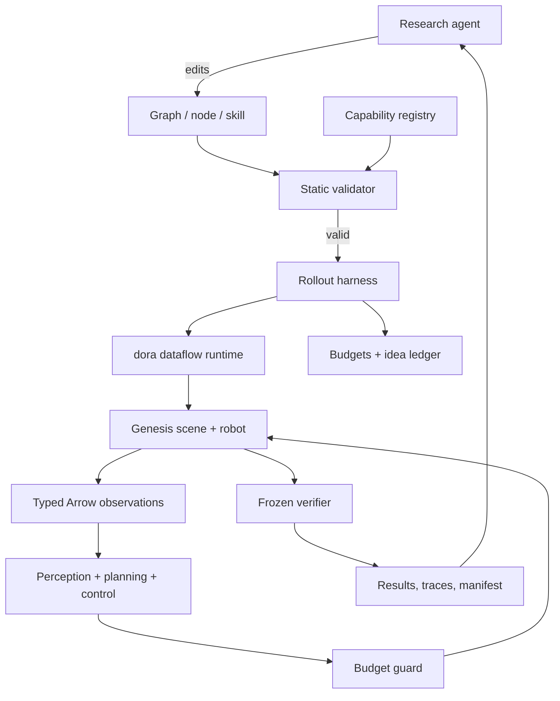
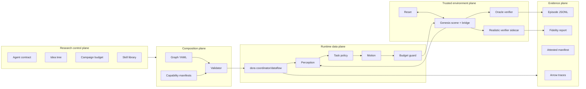
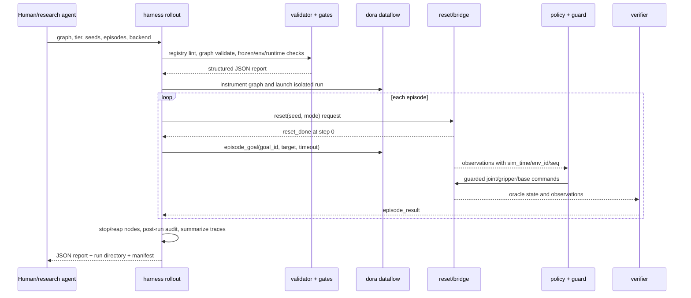
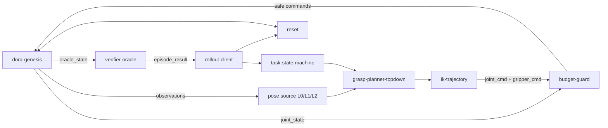

# AISLE contributor wiki

> DeepWiki-style repository guide for contributors. Snapshot: 2026-08-10.
> This page describes the implementation in this tree; dated research results
> remain tied to the commits recorded in their evidence.

AISLE is the **Agentic Infrastructure for Safe Learning and Execution**: an experimental system
in which coding agents assemble and improve typed robot dataflows, run them in
simulation, inspect structured evidence, and carry successful components into
harder tasks. Its central research question is not merely whether an agent can
write a robot policy. It is whether an agent can conduct a safe, reproducible
engineering loop around a modular physical-AI system.

The full question, experimental logic, evidence standard, and advanced-model
agenda are developed in the technical
**[AISLE research program](research-program.md)**. This page remains the map
from that framing to the implementation in the repository.

This guide is the broad map. Use the linked specifications for normative
requirements and the linked code for exact behavior. Exact graph, capability,
CLI, and ADR catalogs are maintained in the source-derived
[`project-inventory.md`](generated/project-inventory.md) appendix and checked
for drift in CI. Tests appear there as suite directories and configured
markers only, not as a module-by-module catalog: enumerating every module made
two independently-green PRs merge, without conflict, into a main whose
appendix was already stale. The JSON from `uv run python
tools/docs_inventory.py --check` reports the current tracked module count;
`uv run pytest --collect-only` reports collected test cases. For requirement
coverage run [`tools/trace_check.py`](../tools/trace_check.py) through `uv`.

## 1. Read this first

The repository has four kinds of truth. They answer different questions:

| Source | Question it answers | Authority |
|---|---|---|
| [`specs/`](../specs/) | What must the system do? | Normative. Requirement IDs govern implementation. |
| [`src/`](../src/), [`graphs/`](../graphs/), [`tests/`](../tests/) | What does this checkout actually do? | Executable implementation reality. |
| [`docs/decisions/`](decisions/) | Why was an ambiguous or consequential choice made? | Historical design record; later amendments can supersede early text. |
| [`analysis/`](../analysis/) and run manifests | What was measured, under which treatment and provenance? | Experimental evidence, valid only within its stated scope. |

Overview documents are useful orientation, but some are older than the current
L1/L2 perception, realistic-verifier, SO-101, and Linux CUDA work. When prose
and code appear to disagree, check the governing spec, later ADRs, tests, and
current implementation before drawing a conclusion. Do not silently edit a
spec to match code; the conflict process is defined in
[`CLAUDE.md`](../CLAUDE.md) and CON-13/14.

### Fast mental model

AISLE is two nested loops:

1. The **runtime loop** executes one robot dataflow: reset, observe, decide,
   guard, actuate, verify, and record.
2. The **research loop** lets a coding agent inspect results, propose one idea,
   edit a graph/node/skill, validate it, roll it out, and keep or revert it.



The load-bearing boundary is between the mutable policy/dataflow and the
trusted environment, verifier, reset, safety, and evidence machinery.

## 2. Project overview

### 2.1 What AISLE is

AISLE is simultaneously:

- a modular robotics runtime built on [dora-rs](https://github.com/dora-rs/dora);
- a Genesis-based manipulation and retail simulation environment;
- a typed capability registry and graph compiler-like validator;
- an experiment harness for seeded, budgeted, provenance-carrying rollouts;
- a skill library with evaluated registration and live node replacement;
- a research testbed for composition, iteration, transfer, safety, and
  verifier-fidelity hypotheses.

The primary implemented task families are:

- **Desk/pharmacy manipulation, T0–T2:** choose a medication box, grasp it,
  place it in a tray, return home, and receive an oracle or realistic verdict.
- **Mobile retail, S1–S3:** fulfill an order, restock missing inventory, or
  correct misplaced products against a planogram.
- **Powder transfer, P0–P4:** specified as a future bench family, but gated on
  a solver/repeatability spike and not yet an implemented benchmark family.

### 2.2 What makes it different

The project treats robot learning as systems research rather than a monolithic
policy benchmark:

- Dataflows are explicit YAML graphs with typed ports.
- Capabilities advertise schemas, embodiments, safety class, source, and eval.
- A validator rejects bad composition before expensive simulation.
- Motion commands must cross a budget guard.
- Oracle state is isolated from policy nodes.
- Reset and scoring live on the trusted side of the experiment.
- Every credible run carries code, environment, graph, platform, seed, and
  runtime evidence.
- Agents log hypotheses and verdicts instead of making an opaque series of
  edits.
- Skills are registered only after validation and evaluation.

### 2.3 Goals and non-goals

The current goals are to measure:

- zero-shot graph composition;
- improvement under an experiment-and-navigate loop;
- transfer from accumulated skills;
- iteration latency of hot swap versus relaunch;
- safety precision and verifier disagreement;
- reproducibility and experimental-integrity failure modes.

The current system does **not** claim:

- production warehouse readiness;
- hardware-validated milligram or manipulation performance;
- full SLAM, dynamic-obstacle navigation, or multi-robot coordination;
- that its realistic verifier is accurate enough to replace oracle scoring;
- bit-identical full-episode physics replay;
- that every registry entry is locally launchable.

## 3. Maturity map

This table is more useful than a single “done/not done” label.

| Area | State in this tree | Important qualification |
|---|---|---|
| T0 expert desk graph | Implemented and M0-signed-off | Historical M0 result: 0.98 over 50 seeds. |
| L0 oracle-pose perception | Implemented | Non-privileged `poses`; not appropriate for higher perception claims. |
| L1 segmentation + depth | Implemented | Uses synchronized segmentation/depth and scene-published ID map. |
| L2 open-vocabulary RGB/depth | Implemented | RGB supplies identity; same-stamp ordinary sensor depth supplies metric geometry. |
| Oracle verifier/reset | Implemented and frozen | Oracle result is the metric ground truth. |
| Realistic verifier | Implemented, measured | Conservative but currently high false-fail rate; not a replacement oracle. |
| Capability registry/validator | Implemented | Installability checks exist; some hub capabilities remain unavailable locally. |
| Rollout/evidence harness | Implemented | Includes budgets, attestation, tracing, reaping, sidecars, and run manifests. |
| Skill registration/hot swap | Implemented | H4 measured only at T0; wider claims remain open. |
| S1–S3 retail infrastructure | Implemented | Reset-anchored startup is fixed; full-episode outcomes are statistical, while wall-coupled timing remains an issue #71 residual. |
| Franka embodiment | Implemented | Main desk arm. |
| SO-101 embodiment | Implemented | Official 5+1 joint model and shared contract. |
| Mobile base + Franka | Implemented | Kinematic/waypoint navigation, not SLAM. |
| macOS Metal/MPS | Primary platform | Full-episode outcomes are statistical under chaotic physics. |
| Linux CPU simulation | Supported dependency path | Selected with `--extra sim`. |
| Linux CUDA simulation | Explicit optional path | Selected with mutually exclusive `--extra cuda` and attested by rollout. |
| Powder bench family | Specified/gated | Only the spike tooling and draft decision record exist today. |
| Real hardware | Future/stretch | Topic contract is designed to make drivers swappable, but hardware proof is pending. |

## 4. Architecture

### 4.1 Layered view



The layers are intentionally separate:

- **Research control plane:** controls what an agent may edit and how much it
  may spend.
- **Composition plane:** turns cataloged capabilities into a statically checked
  graph.
- **Runtime plane:** moves Arrow messages through dora nodes.
- **Trusted environment plane:** owns world truth, reset, and scoring.
- **Evidence plane:** makes later audit and replay possible.

### 4.2 A rollout, end to end



The runner refuses rather than guesses when graph rung, embodiment, backend,
runtime pair, frozen baseline, installed environment, or research budget does
not satisfy the requested treatment.

### 4.3 The desk manipulation dataflow

The expert graphs make the architecture concrete:



Only the pose source changes across the three desk graphs:

| Rung | Graph | Policy input | Privilege boundary |
|---|---|---|---|
| L0 | [`expert_t0.yaml`](../graphs/expert_t0.yaml) | Simulator-derived `poses` | Allowed as non-privileged oracle perception baseline. |
| L1 | [`expert_t1.yaml`](../graphs/expert_t1.yaml) | `seg_overhead` + `depth_overhead` | No `poses`; estimator reconstructs object pose. |
| L2 | [`expert_t1_l2.yaml`](../graphs/expert_t1_l2.yaml) | RGB detection + depth | No `poses` or segmentation consumed by policy. |

`oracle_state` is different from `poses`: it is verifier-only privileged state
and the validator prevents policy consumption. The rung is declared in graph
configuration and announced in `bridge_info`, so it rides both the graph hash
and recorded trace.

### 4.4 Mobile retail dataflow

The retail stack adds a kinematic differential-drive base, known-map waypoint
navigation, order/task planning, and planogram scoring. Arm and base commands
share the guard: motion above creep speed is mutually exclusive with extended
arm motion. The current graph is [`expert_s1.yaml`](../graphs/expert_s1.yaml);
registered skills drive the S1/S3 evaluation graphs.

Retail tasks are parameterizations of one world and verifier:

| Tier | Task | Success surface |
|---|---|---|
| S1 | Fulfill a multi-item order | All and only requested products reach the counter. |
| S2 | Restock two missing slots | Correct category and placement in assigned slots. |
| S3 | Correct two planogram swaps | Correct destination, placement, and no new origin error. |

The planogram is shared by scene generation, task generation, and verification,
preventing three divergent definitions of shelf truth.

## 5. Major subsystems

### 5.1 Genesis scenes and embodiments

[`src/aisle/scenes/pharmacy.py`](../src/aisle/scenes/pharmacy.py) builds the
desk world, robots, medicine boxes, tray, sensors, and oracle state. Configuration
is data-driven by [`meds.toml`](../src/aisle/scenes/meds.toml) and
[`physics.toml`](../src/aisle/scenes/physics.toml). It supports the Franka and
SO-101 profiles and chooses Metal/CPU/CUDA explicitly rather than silently.

[`src/aisle/scenes/store.py`](../src/aisle/scenes/store.py) extends the world
with shelves, aisles, delivery counter, bins, a mobile base, seeded scenarios,
and planogram-derived product placement. Its supporting sources are
[`planogram.toml`](../src/aisle/scenes/planogram.toml) and
[`locations.toml`](../src/aisle/scenes/locations.toml).

[`src/aisle/embodiment.py`](../src/aisle/embodiment.py) centralizes robot
profiles so graph validation, scene construction, joint ordering, and motion
limits agree.

### 5.2 The dora–Genesis bridge

[`src/aisle/nodes/dora_genesis.py`](../src/aisle/nodes/dora_genesis.py) is the
largest runtime integration point. It:

- creates the selected scene and backend;
- publishes camera, depth, segmentation, joint, gripper, base, pose, oracle,
  and startup-information topics at contracted rates;
- accepts guarded joint, gripper, and base commands;
- coalesces commands to avoid unbounded queues;
- anchors scheduling to reset and quarantines observation publication during
  reset;
- handles episode and navigation state;
- publishes bridge, frame, and segmentation-map metadata;
- preserves reset/service request IDs and action goal IDs;
- exposes enough state for frozen verification without exposing oracle state to
  policy nodes.

Rates are deterministic in simulation time. Hardware implementations must meet
the same wire contract in wall time.

### 5.3 Perception ladder

AISLE makes information access a graph-level contract:

- **L0:** [`oracle_pose.py`](../src/aisle/nodes/oracle_pose.py) consumes the
  non-privileged `poses` baseline.
- **L1:** [`segmented_pose.py`](../src/aisle/nodes/segmented_pose.py) joins
  equal-timestamp segmentation and depth, uses the bridge-published scene
  segmentation IDs, and reports supporting mask size.
- **L2:** [`l2_pose.py`](../src/aisle/nodes/l2_pose.py) performs open-vocabulary
  OWLv2 detection, identity-margin checks, and depth-based position recovery.
- [`perception_session.py`](../src/aisle/nodes/perception_session.py) owns
  model/session setup shared by perception nodes.

The validator rejects forbidden topics for a rung, a missing declared rung, or
a graph whose requested `--perception` assertion disagrees with its own
configuration.

### 5.4 Planning and motion

The desk expert is deliberately understandable rather than learned end to end:

- [`grasp_topdown.py`](../src/aisle/nodes/grasp_topdown.py) selects and scores a
  top-down grasp with neighbor awareness.
- [`ik_trajectory.py`](../src/aisle/nodes/ik_trajectory.py) solves analytic IK
  and produces staged approach, grasp, lift, transit, release, and home motion.
- [`task_state_machine.py`](../src/aisle/nodes/task_state_machine.py) sequences
  the manipulation episode.
- [`kinematics.py`](../src/aisle/kinematics.py) holds reusable arm kinematics.

Retail decomposes order reading, task planning, navigation, stock/misplacement
detection, and placement control into separate nodes under
[`src/aisle/nodes/`](../src/aisle/nodes/). The scripted S1 expert and registered
S1/S3 skills are reference policies, not a claim that retail is solved.

### 5.5 Safety and budget guard

[`budget_guard.py`](../src/aisle/nodes/budget_guard.py) is the mandatory motion
choke point. The registry classifies any node emitting raw or safe actuation
ports as `motion`; the validator requires motion sinks to be guard-gated and to
have evaluation evidence. Limits come from [`env/limits.toml`](../env/limits.toml).

The guard covers:

- joint position, velocity, and workspace limits;
- gripper commands;
- mobile-base linear/angular limits;
- keep-out and arm/base mutual-exclusion behavior;
- structured violations and periodic statistics.

It is a structural safety mechanism, not a complete physical safety case.

### 5.6 Verification and reset

[`verifier/oracle.py`](../src/aisle/verifier/oracle.py) is a pure judgment
function for desk episodes. Its failure classes are `wrong_object`, `dropped`,
`timeout`, `never_grasped`, and `collision`. Oracle success is the only result
counted as ground-truth success.

[`verifier/retail.py`](../src/aisle/verifier/retail.py) scores product identity,
quantity, slot, position, yaw, front face, overhang, and alignment. Placement
thresholds are configuration, not scattered policy constants.

[`verifier/realistic.py`](../src/aisle/verifier/realistic.py), its stage library,
and [`nodes/verifier_realistic.py`](../src/aisle/nodes/verifier_realistic.py)
implement a pixel-grounded verifier. It emits auditable stage votes for
calibration, identity from overhead/wrist views, containment, uprightness, and
home state. It runs alongside the oracle for fidelity analysis; it does not
replace oracle metrics.

[`reset/service.py`](../src/aisle/reset/service.py) implements the typed reset
service. Both modes are implemented **in simulation**: teleport (RST-1) delegates
state injection to the bridge, and behavioral (RST-2) commands the robot to
re-shelve the delivered box through the guarded motion path, with bounded retry
and a teleport fallback. [A6](../analysis/a6/a6_findings.md) measured a paired
10-episode ablation — 7 behavioral successes, 3 fallbacks — on
[`graphs/expert_t1_behavioral.yaml`](../graphs/expert_t1_behavioral.yaml), the
one graph wired to serve it (`harness rollout --reset behavioral` refuses the
others rather than silently teleporting, issue #196). Hardware reset parity
remains untested; that is the future-facing part.

`reset_done` is the episode boundary and nothing else — a refused request answers
on `reset_refused` (ADR-34). Reset, scenes, verifiers, and expert graphs are in
the post-M0 frozen set.

### 5.7 Capability registry

The registry is a typed catalog under [`registry/manifests/`](../registry/manifests/).
Each YAML manifest declares:

- a stable capability ID and version;
- input/output ports using a closed Arrow schema vocabulary;
- supported embodiment(s);
- source location (`src/...` or external `pip:...`);
- origin and safety class;
- evaluation card or permitted non-motion exception.

[`registry/schema/capability.schema.json`](../registry/schema/capability.schema.json)
defines manifest shape. [`schemas.toml`](../registry/schema/schemas.toml) is the
closed schema vocabulary. [`curated_core.toml`](../registry/schema/curated_core.toml)
defines the intended core discovery surface.

Registry tooling can lint all manifests, search by provided capability and
embodiment, and restrict results to installed/launchable sources. That last
check is important: the H1 experiment found that a schema-valid graph can still
fail to launch when an advertised external package is absent.

### 5.8 Static graph validator

[`harness/validate.py`](../src/aisle/harness/validate.py) acts like a compiler
front end for dora graphs. It parses the graph and manifests, then checks:

- node IDs, sources, inputs, outputs, and edge syntax;
- capability existence and source launchability;
- exact schema compatibility and contracted rates;
- required inputs, unique producers, and dangling edges;
- embodiment compatibility;
- motion eval requirements and mandatory budget-guard topology;
- oracle-state isolation;
- perception-rung topic restrictions;
- reset/verifier/rollout lifecycle connectivity;
- environment declarations relevant to the experimental treatment.

Errors are stable structured codes with edge/node context and actionable hints.
Agents are expected to use validation as a compile-and-repair loop before
buying simulation time.

### 5.9 Rollout harness and evidence

[`harness/rollout.py`](../src/aisle/harness/rollout.py) coordinates a run. It:

- validates registry and graph;
- enforces the open-idea gate and campaign budgets;
- verifies the frozen baseline and installed dependency selection;
- checks the host dora CLI against the pinned Python API revision;
- instruments a temporary graph with tracing and optional realistic verifier;
- launches dora with a scrubbed, explicit environment;
- watches startup, episode progress, liveness, and time ceilings;
- collects results and realistic-verifier stage records;
- reaps orphan processes;
- performs post-run frozen/environment/runtime audits;
- writes the run manifest and campaign ledger entry.

A normal run directory under ignored `runs/<run-id>/` contains some combination
of:

- `manifest.json`: treatment, git, graph, environment, platform, backend,
  runtime, seeds, gates, and audit state;
- `episodes.jsonl`: episode outcomes;
- Arrow traces and a trace index;
- realistic-verifier sidecar records and fidelity output;
- process/log diagnostics.

Do not compare pass rates without first checking whether both records are
admissible under their protocol and attestation rules.

### 5.10 Skills, ideas, and live iteration

The research agent logs each hypothesis through `harness report log`, closes it
with an observed result and `up|down|flat` verdict, and may register a reusable
skill. [`harness/skill.py`](../src/aisle/harness/skill.py) validates the skill
descriptor and evaluation graph, runs the declared evaluation, produces an
evalcard, and installs the manifest only after acceptance.

[`harness/swap.py`](../src/aisle/harness/swap.py) validates a replacement node,
mutates a live dora dataflow, waits for health, records a swap event, and can
attach a temporary topic probe. This supports faster iteration while retaining
an auditable mutation history.

## 6. Graph catalog

| Graph | Purpose | Key distinction |
|---|---|---|
| [`expert_t0.yaml`](../graphs/expert_t0.yaml) | Desk expert baseline | L0 `poses`, oracle verifier. |
| [`expert_t1.yaml`](../graphs/expert_t1.yaml) | Desk L1 baseline | Segmentation + depth pose estimation. |
| [`expert_t1_l2.yaml`](../graphs/expert_t1_l2.yaml) | Desk L2 baseline | Open-vocabulary RGB/depth pose. |
| [`expert_s1.yaml`](../graphs/expert_s1.yaml) | Mobile retail expert | Order fulfillment with waypoint navigation. |
| [`agent_campaign.yaml`](../graphs/agent_campaign.yaml) | H3 S3 campaign graph | Store re-shelving with the agent-authored S3 skill. |
| [`eval_s1_driver_v2.yaml`](../graphs/eval_s1_driver_v2.yaml) | Registered S1 skill evaluation | Reproducible skill gate. |
| [`eval_s3_driver_v1.yaml`](../graphs/eval_s3_driver_v1.yaml) | Registered S3 skill evaluation | Planogram-correction skill gate. |

Generated candidate graphs may appear during research runs but are not part of
the curated committed catalog. Desk graphs validate with the default `franka`
embodiment; retail graphs must be validated with `--embodiment mobile`.

## 7. Capability catalog

The 30 committed manifests fall into these groups:

| Group | Capabilities |
|---|---|
| Runtime/drivers | `dora-genesis`, `camera-source`, `arm-driver-sim`, `gripper-driver-sim`, `base-driver-sim`, `reset`, `rollout-client` |
| Safety/motion | `budget-guard`, `grasp-planner-topdown`, `ik-trajectory`, `nav-action`, `waypoint-nav`, `placement-controller` |
| Desk perception | `oracle-pose`, `segmented-pose`, `detector-openvocab`, `pose-estimator`, `detected-pose`, `ocr-label` |
| Task logic | `task-state-machine`, `task-planner`, `order-reader`, `patrol-planner` |
| Retail perception/control | `stock-detector`, `misplacement-detector`, `s1-expert` |
| Verification | `verifier-oracle`, `verifier-retail` |
| Registered skills | `s1-driver-v2`, `s3-driver-v1` |

Some hub-origin perception manifests point at external `pip:` packages and are
deliberately not guaranteed to be installed. Use installed-only discovery or
the validator, and do not infer launchability from schema validity alone.

## 8. Data contracts

### 8.1 Wire rules

All hot-path inter-node data is Apache Arrow. Core conventions from
[`SPEC 010`](../specs/010-topic-contract.md) are:

- radians, meters, base frame unless named otherwise;
- quaternions ordered `(x, y, z, w)`;
- metadata on outputs: `sim_time_ns`, `env_id`, and monotonic per-topic `seq`;
- flat typed arrays for images and state, with image shape/encoding in metadata;
- JSON only on goals, results, reports, and similar low-rate control topics;
- services use `request_id`; actions use `goal_id`.

The closed schemas include RGB, depth, segmentation, joint/scalar state, pose,
detections/labels, reset request/reply, timer, and mobile base pose/command/scan.
Adding a schema is a contract change, not a casual manifest edit.

### 8.2 Core runtime topics

| Topic | Meaning | Typical rate |
|---|---|---|
| `rgb_overhead`, `rgb_wrist` | Flat RGB8 images | 30 Hz |
| `depth_overhead` | Meter depth, zero invalid | 15 Hz |
| `seg_overhead` | L1-only simulator segmentation IDs | 15 Hz |
| `joint_state`, `gripper_state` | Robot state | 100 Hz |
| `poses` | L0 non-privileged object poses | 15 Hz |
| `oracle_state` | Verifier-only object truth | 30 Hz |
| `joint_cmd`, `gripper_cmd` | Guarded actuation targets | ≤100/30 Hz |
| `base_pose`, `base_cmd`, `base_scan` | Mobile profile state/control/range | 50/≤50/10 Hz |
| `reset`, `reset_done` | Typed service request/reply | Per episode |
| `episode_goal`, `episode_feedback`, `episode_result` | Episode action lifecycle | Per episode / ≥1 Hz / per episode |

Use [`src/aisle/topics.py`](../src/aisle/topics.py) and the schema vocabulary
instead of recreating Arrow payload conventions inside a node.

## 9. Contributor use cases

### 9.1 Set up and validate the repository

```bash
uv sync
uv run ruff format --check .
uv run ruff check .
uv run pytest -m unit
uv run python -m aisle.harness.registry lint
uv run harness validate graphs/expert_t0.yaml
```

For simulation on macOS or Linux CPU:

```bash
uv sync --extra sim
```

For explicit Linux CUDA:

```bash
uv sync --extra cuda
```

The extras are mutually exclusive. The dora CLI must be built from the same
Git revision pinned for the Python API in [`pyproject.toml`](../pyproject.toml).
See [`env/CONTRACT.md`](../env/CONTRACT.md) and
[`troubleshooting.md`](troubleshooting.md) before diagnosing runtime failures.

### 9.2 Run a desk episode

```bash
uv run harness rollout \
  --graph graphs/expert_t0.yaml \
  --tier T0 \
  --episodes 1 \
  --seeds 3 \
  --reset teleport \
  --perception L0 \
  --env-baseline local
```

`--env-baseline local` is a human development override. It records evidence but
does not create the same trust claim as a run checked against a trusted remote
baseline. Research campaigns should follow their protocol rather than copying
this convenience command.

To compare realistic and oracle verification on the same episodes, add
`--verifier both`. To select Linux CUDA, add `--sim-extra cuda` and ensure the
environment was resolved with the CUDA extra.

### 9.3 Inspect a failure

Start with `runs/<id>/manifest.json` and `episodes.jsonl`, then query only the
topic/window you need:

```bash
uv run harness traces query \
  --run <run-id> \
  --topic joint_state \
  --episode 0 \
  --summarize
```

Useful debugging sequence:

1. Confirm gates, `attested`, graph hash, rung, embodiment, backend, and dora
   identities in the manifest.
2. Read the episode failure class and verifier details.
3. Slice from that episode's `reset_done`, never from a neighboring result
   boundary.
4. Compare pose, planner phase, safe commands, robot state, and verifier inputs.
5. If the graph is live, use `harness probe` for a short, recorded inspection.
6. Log an idea before changing behavior; close it after measured evidence.

### 9.4 Compose a new graph

1. Search the registry for capabilities providing the required port.
2. Prefer installed/launchable results and check embodiment compatibility.
3. Copy the smallest related graph—not necessarily the most feature-rich one.
4. Declare the perception rung in the bridge node.
5. Route every motion command through `budget-guard`.
6. Keep privileged oracle inputs connected only to verifier/reset paths.
7. Validate and repair structured errors until `ok: true`.
8. Run the smallest seeded rollout that can test the composition.

Graph changes under `expert_*.yaml` are frozen-set changes and require the
Class C process.

### 9.5 Add a new node/capability

The minimum complete contribution is usually:

- node implementation under `src/aisle/nodes/` or the appropriate subsystem;
- manifest under `registry/manifests/`;
- existing schema names from `schemas.toml` wherever possible;
- deterministic injected RNG/time where needed;
- unit tests for pure logic and graph/acceptance tests for wiring/runtime;
- an evalcard for motion capabilities;
- a graph or fixture demonstrating valid composition;
- requirement IDs in test docstrings and the PR description.

Do not put JSON on a hot data topic, invent a private shape convention, bypass
the guard, read oracle state in policy, or advertise an unavailable source as
launchable.

### 9.6 Add a skill

A skill directory contains `skill.yaml`, an implementation, and `eval.yaml`.
Register it through the harness rather than copying it into the manifest set:

```bash
uv run harness skill register skills/<name> --run-id <eval-run-id>
```

Registration validates the descriptor and evaluation graph, runs the frozen
evaluation, writes the evalcard, and installs only a passing skill. Review
[`skills/s1-driver-v2`](../skills/s1-driver-v2/) for a compact example.

### 9.7 Conduct a research iteration

```bash
uv run harness report log \
  --idea "neighbor-aware grasp scoring reduces dropped boxes" \
  --expect "fewer dropped outcomes on seeds 0..9"

# edit one surface, validate, and roll out

uv run harness report close \
  --id <idea-id> \
  --observed "8/10 to 10/10; no wrong_object" \
  --verdict up
```

The separate research-agent rules are in
[`harness/CLAUDE.research.md`](../harness/CLAUDE.research.md). They forbid edits
to the frozen environment and define token, episode, and wall budgets. A
research result is not admissible merely because a policy improved; treatment
contamination, baseline drift, runtime drift, missing provenance, or a partial
holdout can invalidate the comparison.

## 10. Extension guide

| Extension | Primary files | Required integration work | Risk |
|---|---|---|---|
| New pure planning node | `src/aisle/nodes/`, manifest, unit tests | Typed ports, deterministic logic, graph validation | Class B |
| New motion capability | Node, manifest, eval graph/card | Motion classification, guard route, affected acceptance tests | Class B/C depending on contracts |
| New perception rung | Topic spec, bridge, node, graph, validator, tests | Publish restrictions, graph attestation, fidelity baseline | Class C |
| New Arrow topic/schema | SPEC 010, `schemas.toml`, manifests, bridge/tests | Rate, shape, metadata, hardware semantics | Class C/spec-change |
| New graph | `graphs/`, manifests/tests | Full validation, lifecycle, guard, rung, embodiment | Class B; expert graph is frozen Class C |
| New skill | `skills/<name>/`, eval graph | Registration eval and generated manifest/evalcard | Class B |
| New task tier | Scenario generator, goal schema, verifier, graph, harness tests | Frozen scoring boundary and seeded reset | Usually Class C |
| New scene family | `scenes/`, configs, verifier/reset, specs | Pure seeded build, oracle surface, acceptance expert | Class C after freeze |
| New embodiment | `embodiment.py`, scene/bridge, contract, manifests | Joint names/order, limits, driver parity, acceptance | Class C |
| New backend | dependency extra, scene selection, harness attestation | Explicit selection, lock fingerprint, parity tests | Class C environment impact |
| Hardware driver | External/local node + manifest | Byte-for-byte topic contract, real-time rates, safety/eval | Class C and human safety review |
| New verifier stage | `verifier/`, sidecar/fidelity tests | Pure/replayable judgment, calibration, fail-closed semantics | Frozen Class C |
| New campaign | `tools/`, protocol ADR, `analysis/` | Pin treatment/runtime/baseline, budgets, admissibility analysis | Class A tooling plus human protocol review |

### Recommended extension sequence

For most new task families, extend in this order:

1. Write/ratify the scenario and topic contract.
2. Implement a pure seeded scene and oracle state.
3. Implement a pure verifier with table-driven edge cases.
4. Implement reset and bridge topics.
5. Add typed manifests and validator rules.
6. Build a simple expert graph as an integration gate.
7. Freeze the environment surface.
8. Only then run agent composition or improvement experiments.

This avoids measuring an agent against a moving or underspecified benchmark.

## 11. Repository structure

```text
aisle/
├── CLAUDE.md                 development-agent contract and quality loop
├── TASKS.md                  dependency-ordered implementation roadmap
├── pyproject.toml            package, dependencies, uv extras, pytest/ruff config
├── uv.lock                   exact dependency resolution
├── specs/                    normative contracts and benchmark definitions
├── src/aisle/
│   ├── scenes/               Genesis worlds and TOML scene data [frozen]
│   ├── nodes/                dora bridge, perception, policy, control, verifier node
│   ├── verifier/             pure oracle/retail/realistic judgment [frozen]
│   ├── reset/                reset service [frozen]
│   ├── harness/              validate, rollout, traces, skills, swap, evidence
│   ├── mobility/             base model, navigation, mobile safety
│   ├── embodiment.py         robot profiles and joint semantics
│   ├── kinematics.py         arm kinematics
│   └── topics.py             Arrow payload helpers/contracts
├── graphs/                   committed dora dataflows; expert graphs frozen
├── registry/
│   ├── schema/               manifest JSON Schema and Arrow vocabulary
│   └── manifests/            one typed capability record per YAML
├── skills/                   registered reusable policy components
├── harness/                  research-agent contract
├── tests/
│   ├── unit/                 fast, no Genesis/dora
│   ├── sim/                  headless Genesis
│   ├── graph/                live dora dataflows
│   └── accept/               requirement-citing spec acceptance
├── tools/                    CI, campaigns, analyses, fixtures, spikes
├── analysis/                 committed findings and selected evidence bundles
├── env/                      frozen limits and environment contract/hash
├── docs/
│   ├── decisions/            ADRs and protocol interpretations
│   ├── upstream/             dora issue records
│   └── ...                   architecture, workflow, troubleshooting, this wiki
└── runs/                     ignored live run artifacts
```

### Code navigation by question

| Question | Start here |
|---|---|
| How is a run admitted and launched? | [`harness/rollout.py`](../src/aisle/harness/rollout.py) |
| Why is my graph rejected? | [`harness/validate.py`](../src/aisle/harness/validate.py) and validator tests |
| How are capabilities discovered? | [`harness/registry.py`](../src/aisle/harness/registry.py) |
| Where do dora events enter Genesis? | [`nodes/dora_genesis.py`](../src/aisle/nodes/dora_genesis.py) |
| How is the desk world built? | [`scenes/pharmacy.py`](../src/aisle/scenes/pharmacy.py) |
| How is the store built/scored? | [`scenes/store.py`](../src/aisle/scenes/store.py), [`verifier/retail.py`](../src/aisle/verifier/retail.py) |
| What counts as desk success? | [`verifier/oracle.py`](../src/aisle/verifier/oracle.py) |
| How does realistic scoring work? | [`verifier/realistic.py`](../src/aisle/verifier/realistic.py), [`verifier/stages.py`](../src/aisle/verifier/stages.py) |
| How are traces written/queried? | [`harness/trace_recorder.py`](../src/aisle/harness/trace_recorder.py), [`harness/traces.py`](../src/aisle/harness/traces.py) |
| How is environment identity computed? | [`tools/env_hash.py`](../tools/env_hash.py), [`env/CONTRACT.md`](../env/CONTRACT.md) |
| How does live replacement work? | [`harness/swap.py`](../src/aisle/harness/swap.py) |
| What should an autonomous research agent do? | [`harness/CLAUDE.research.md`](../harness/CLAUDE.research.md) |

## 12. CLI reference

The main installed command is `harness`:

| Command | Purpose |
|---|---|
| `harness validate <graph>` | Static graph, registry, safety, and rung validation. |
| `harness rollout ...` | Run seeded episodes with evidence and budget enforcement. |
| `harness traces query ...` | Slice/summarize recorded Arrow topics. |
| `harness report log|close ...` | Maintain the hypothesis/idea tree. |
| `harness skill register ...` | Validate, evaluate, and install a skill. |
| `harness swap ...` | Replace a node on a live dataflow. |
| `harness probe ...` | Attach a temporary topic inspector. |

Registry commands run as a module:

```bash
uv run python -m aisle.harness.registry lint
uv run python -m aisle.harness.registry search --provides <port>
uv run python -m aisle.harness.registry search --provides <port> --installed
```

All project CLIs follow CON-8: argparse input, one JSON object on stdout, logs
on stderr, and exit zero only when `ok` is true. `--help` is the documented
argparse carve-out.

## 13. Testing and contribution workflow

### 13.1 Test taxonomy

| Marker | Scope | Expected use |
|---|---|---|
| `unit` | No sim or dora; fast | Every change. |
| `sim` | Imports Genesis headlessly | Scene, physics, perception, verifier integration. |
| `graph` | Launches a dora dataflow | Wiring, guard, lifecycle, runtime behavior. |
| `accept` | Requirement-citing acceptance | Spec gates and release confidence. |

The repository carries extensive validator goldens and adversarial cases across
these suites. Module counts are deliberately not quoted here — read the
`test_modules` field from `uv run python tools/docs_inventory.py --check` when
the current tracked count matters, or run `uv run pytest --collect-only` for
the collected test cases. What matters more is the requirement-ID traceability checked by
[`tools/trace_check.py`](../tools/trace_check.py), which fails CI when a MUST
has no citing test.

### 13.2 Required development loop

1. Read [`CLAUDE.md`](../CLAUDE.md), the constitution, the relevant spec, and
   the task/design context.
2. Restate the requirement IDs.
3. Write acceptance/unit tests first, citing those IDs in docstrings.
4. Implement until the relevant tests pass.
5. Record an ADR if a spec is ambiguous; stop and open a conflict if spec and
   test disagree.
6. Run review/simplification and the gates in the required order.
7. Open one conventional-commit PR for one concern, listing affected IDs.
8. Use the other coding-agent family for cross-review; findings belong in PR
   comments, not direct pushes.

Baseline local gates:

```bash
uv run ruff format --check .
uv run ruff check .
uv run pytest -m unit
uv run python tools/trace_check.py
uv run python tools/docs_inventory.py --check
uv run python tools/env_hash.py --check
```

Add `uv run pytest -m "sim or graph"` when simulation or graph code changes.
Acceptance and nightly surfaces apply before releases. [`tools/ci.sh`](../tools/ci.sh)
is the repository CI entry point.

### 13.3 Risk classes and frozen set

- **Class A:** docs, tests, tools; baseline gates.
- **Class B:** nodes and harness; baseline plus affected acceptance tests.
- **Class C:** contracts or the frozen set; human review required.

After M0, `src/aisle/scenes`, `src/aisle/verifier`, `src/aisle/reset`, and
`graphs/expert_*.yaml` are frozen. Changes require a human-merged `env-change`
PR and updated committed environment hash. Files under `specs/` require a
separate `spec-change` process.

## 14. Reproducibility, trust, and safety model

### 14.1 Layered reproducibility

The recorded treatment identity is based on code, graph, dependency selection,
platform, seed, and host runtime—not a version label alone. Current CON-5 is
explicitly layered:

1. Seed-derived goals/plans/reset state and the first post-reset snapshot must
   be bit-identical.
2. Reset anchoring and trace cadence must be exact.
3. Physics state must match within tolerance for a defined early comparison
   window.
4. Full-episode outcomes are statistical distributions because small backend
   differences amplify chaotically.

Replicate gates must independently meet the original acceptance threshold and
persist success counts and per-seed flips. “No statistically significant
difference” is not evidence of equivalence.

### 14.2 Trust boundaries

| Boundary | Enforcement |
|---|---|
| Agent vs frozen benchmark | Git/frozen hash gates, path audit, human Class C review. |
| Policy vs oracle truth | Manifest/graph validation of privileged topics. |
| Policy vs actuators | Mandatory budget-guard topology and motion classification. |
| Claimed environment vs installed files | Lock-derived environment fingerprint and post-run audit. |
| Python API vs host dora runtime | Same-revision identity and executable content capture. |
| Experiment arm vs prior results | Pinned isolated worktree and protocol-specific contamination checks. |
| Realistic vs oracle verifier | Same-episode sidecar and fidelity analysis. |

### 14.3 Common integrity traps already observed

- A registry capability can be type-correct but unavailable to launch.
- Committed findings from one experimental arm can contaminate a repo-reading
  agent in another arm.
- A clean Git tree does not prove the external dora executable matches the pin.
- A moving remote baseline can change a treatment during a long campaign.
- Reset-boundary frames can visually belong to the previous episode.
- Same recorded high-level tuple does not imply identical long-horizon outcome.
- Dirty-tree measurements cannot support reproducibility claims.
- A small easy seed range can badly misstate verifier fidelity.

These are first-class project results, not incidental housekeeping.

## 15. Research program and current evidence

Treat this as a map to the findings, not a substitute for reading their
protocols and limitations.

| Study | Current result | Evidence |
|---|---|---|
| M0 expert baseline | T0 expert passed 49/50 (0.98); the milestone replicate independently re-satisfied the acceptance gate. | [`ADR-M0`](decisions/ADR-M0.md) |
| H1 zero-shot composition | 40/40 first validation, but launch+valid only 15% and 65% by agent arm; target not met. Missing external capabilities dominated. | [`h1_findings.md`](../analysis/h1/h1_findings.md) |
| H2 iterative improvement | Both independent arms met the ≥0.9 supported-performance target; held-out 1.0 and 0.875. | [`h2_findings.md`](../analysis/h2/h2_findings.md) |
| H3 skill accumulation | UNDECIDED on both ladders. Retail: no admissible library cell survived the drift audit. Desk (T1→T4): `met: null`, 13 caveats; T4 ratio ~1.03 (parity), T2/T3 unsolved by either arm. **The finding is the ladder's difficulty spacing, not the library** — no tier sits in the band between trivial and impossible where a speedup could show. Reuse verified live (`s3-driver-v1` embedded verbatim in a desk deliverable). | [`h3_findings.md`](../analysis/h3/h3_findings.md), [`desk_findings.md`](../analysis/h3/desk/desk_findings.md) |
| H4 iteration latency | T0 hot swap median 32.4 s vs relaunch 41.8 s, n=6 each; development evidence is explicitly unattested. | [`h4_findings.md`](../analysis/h4/h4_findings.md) |
| H5 delivery precision | 0 wrong-object in 224/224 H2 episodes and 0 in every campaign since — desk H3, A3, A4, A6, and all 13 A5 fleet lanes under 8-way concurrent iteration (~40 agent sessions). A denominator, not an absolute. | [`h2_findings.md`](../analysis/h2/h2_findings.md), [`a5_findings.md`](../analysis/a5/a5_findings.md) |
| A1 composition ablation | Zero-shot composition has a large end-to-end T1 tax; iterative agents close it. S1 comparison is inconclusive. | [`a1_table.md`](../analysis/a1/a1_table.md) |
| A3 params-only vs params+code | The constrained arm won on efficiency at equal quality: 1.0/1.0 both arms, but 200k vs 396k tokens and 1 vs 4 dev rollouts. Schema-as-subsidy where the registry covers the task. n=1/arm. | [`a3_findings.md`](../analysis/a3/a3_findings.md) |
| A4 Claude Code vs Codex | Both solve T1 at 1.0/1.0, 0 wrong-object. Codex first-success sooner (8.1 vs 9.7 min) then over-iterates; Claude ~2× cheaper end-to-end (186k vs 364k). Style, not capability. n=1/arm, lower bound. | [`a4_findings.md`](../analysis/a4/a4_findings.md) |
| A5 fleet scaling | Throughput saturates at ~4 lanes/host: 1.6 → 4.1 → 4.3 succ/hr at N=1/4/8. Quality contention-invariant (holdout 1.0 every lane); token super-linearity +22%/+31%. | [`a5_findings.md`](../analysis/a5/a5_findings.md) |
| A6 teleport vs behavioral reset | Teleport 1.00 pass@1 / 6.4 min; behavioral 0.80 / 9.6 min at +19 s per episode, 7 success + 3 audited fallbacks. The reset is itself a manipulation task that fails sometimes. | [`a6_findings.md`](../analysis/a6/a6_findings.md) |
| Tier curves T1/T2 | T1 expert 1.0 per rung; **T2 expert 0.08** (2/25) — the deliberate perception wall. Label reads are accurate when parked (0 wrong reads); tour mechanics dominate the failure budget. | [`t2 findings`](../analysis/t2/t2_curve_findings.md) |
| Phase 2 / Phase 3 DoD | **Both closed 2026-08-16.** Phase 2 complete (8/8). Phase 3 five of six — skill library NOT MET at 2 of ≥5; reachable ceiling was 3 because ADR-37's floor refuses two T2-authored skills at 0.33 and 0.0. | [`phase2_phase3_report.md`](../analysis/reports/phase2_phase3_report.md) |
| §8.4 governance review | Three flags raised against agent code; **all three were harness defects** (self-graded eval floor → ADR-37; unretained deliverables → `refs/campaign/`; a validator rule that would have rejected the frozen corpus, dropped). Zero agent faults. First pass could review only 2 of 5 skills. | [`agent_pr_review_notes.md`](../analysis/reports/agent_pr_review_notes.md) |
| S1 reproducibility | ADR-25 fixed the startup race; ADR-26 makes full-episode outcomes statistical. Wall-coupled command/control timing remains an issue #71 residual. | [`ADR-25`](decisions/ADR-25.md), [`ADR-26`](decisions/ADR-26.md) |
| Realistic verifier fidelity | Current VER-13 recomputation over the same 31 episodes: agreement 0.45, 0/6 false success, 17/25 false fail. The preserved pre-amendment finding was 0.29 / 0 / 0.88. Still conservative and not operationally useful as sole judge. | [`first finding`](../analysis/ver6-fidelity/README.md), [`VER-13`](../specs/040-verifier-reset.md) |

The most important research lesson so far is that **infrastructure honesty is
part of agent capability measurement**. Registry truth, treatment isolation,
runtime identity, reset boundaries, and evidence admissibility changed several
headline interpretations.

The Phase-3 governance review sharpened that into something more specific.
Reviewing every agent-authored skill produced **three findings against the
harness and none against the agents**: a registration gate whose passing grade
the candidate chose, a campaign protocol that left agent code undiscoverable to
any reviewer off the campaign machine, and a proposed validator rule that would
have rejected two frozen expert graphs — aimed at an import the flagged skill
never had. The agents behaved; the fence had gaps they did not exploit. When
this project reports on governing agent-authored robot code, that asymmetry —
and the fact that the first pass could only examine 2 of 5 skills — is part of
the result, not a footnote to it.

## 16. Known limitations and open work

### Runtime and determinism

- ADR-25 fixed and verified the reset/startup race. The remaining issue #71
  residual is wall-coupled command/control timing; retiming frozen graph and
  guard paths requires owner-reviewed environment work.
- Metal physics cannot promise bit-identical long-horizon outcomes; statistical
  replication is required.
- Runtime process isolation/reaping has been hardened, but long multi-process
  campaigns remain operationally sensitive.

### Perception and verification

- L2 exists, but its quality envelope is newer and narrower than L0/L1.
- The realistic verifier is conservative to the point of rejecting most true
  successes in the first measurement, especially at identity/geometry stages.
- Hardware camera calibration, cadence, and domain shift are not established.

### Tasks and embodiments

- Retail uses known-map waypoint navigation, not autonomous mapping.
- Behavioral reset **is** implemented in simulation and measured (A6: 0.80
  pass@1, +19 s/episode, 7 success + 3 audited fallbacks). Real-hardware
  recovery is not implemented.
- **T2 and T3 are unsolved by any agent arm at session budgets.** This is the
  single largest open scientific item: it caps the skill library, and it is why
  H3's accumulation question could not be asked on the desk ladder.
- Powder transfer remains gated; the target ranges and solver budget cannot be
  filled honestly until the spike decision.
- Multi-robot, humanoid, dynamic obstacle, liquid, and regulated-workflow
  concerns are explicitly outside current scope.

### Research evidence

- Several studies have small held-out samples.
- H3 requires a new budget-corrected, runtime-pinned, baseline-frozen campaign
  for a formal verdict.
- H4 lacks the S-tier and monolithic-script control conditions.
- Verifier false-success exposure is only six induced negative episodes.

### Documentation drift

- [`architecture.md`](architecture.md), [`physical-ai-primer.md`](physical-ai-primer.md),
  [`experiments.md`](experiments.md), parts of README, TASKS, and SPEC 010 contain
  dated status language. This page describes the current checkout but does not
  alter their normative/historical role.
- A documentation freshness check is not currently generated from graphs,
  manifests, and tests, so counts and status tables can drift manually.

## 17. Suggested newcomer path

### First hour

1. Read this page and the one-page pitch in
   [`Project_AISLE_Experiment_Design.md`](Project_AISLE_Experiment_Design.md).
2. Read [`specs/000-constitution.md`](../specs/000-constitution.md) and
   [`CLAUDE.md`](../CLAUDE.md).
3. Open `graphs/expert_t0.yaml` beside the capability manifests for its nodes.
4. Run registry lint and graph validation.

### First day

1. Follow one topic from the bridge through policy, guard, scene, and verifier.
2. Run one local T0 episode or inspect a committed evidence bundle if simulation
   is unavailable.
3. Query a trace window and explain the episode phase transitions.
4. Read ADR-M0 plus one failed/qualified research finding such as H1 or H3.

### First contribution

Good starter contributions are:

- correct a dated non-normative documentation claim with source links;
- improve a validator hint and its golden test;
- add an adversarial unit case for a pure verifier/planner function;
- add a generated registry/graph inventory check;
- improve troubleshooting around a reproduced setup failure.

Avoid choosing a first issue that changes a spec, frozen verifier, scene,
expert graph, safety boundary, or environment lock.

## 18. Documentation/publishing options

This single page is the recommended **baseline artifact**: it is reviewable in
the same PR as code, works in GitHub, and gives external indexers a coherent
entry point. From here there are four sensible publication paths.

### Option A — Repository-native Markdown (lowest maintenance)

Keep this page as the canonical overview and link specialized existing docs.
Add a small generated appendix for graph/manifest catalogs and test suites.
Best when code review is the primary contributor workflow.

### Option B — MkDocs Material site (recommended next step)

Split this page into pages for concepts, architecture, subsystems, use cases,
extensions, operations, experiments, and reference. MkDocs handles Mermaid,
navigation, search, versioned repository links, and static hosting with little
application code. Add strict link checking and a generated inventory during CI.

Suggested navigation:

```text
Home
Concepts
  Mental model
  Trust and reproducibility
Architecture
  System layers
  Runtime sequence
  Data contracts
Subsystems
  Scenes and bridge
  Perception
  Planning and safety
  Verification and reset
  Registry and validator
  Harness and evidence
Guides
  Setup and first rollout
  Debug a failure
  Add a node
  Add a skill
  Add a task family
Research
  Hypotheses and findings
  Experimental integrity
Reference
  Graph catalog
  Capability catalog
  CLI
  Repository map
  Glossary
```

### Option C — Docusaurus site

Choose this if the project needs a branded React site, blog/release content,
multiple documentation versions, or custom interactive components. It is more
flexible but creates a larger JavaScript maintenance surface than the project
currently needs.

### Option D — External DeepWiki-style indexing

Use an external code-indexing service as a secondary exploration layer, not the
sole documentation source. It can provide symbol-level question answering and
auto-generated diagrams, but repository-owned prose should remain the reviewed
authority for safety boundaries, maturity, and evidence qualifications.

### Recommended automation

Whichever renderer is chosen, generate rather than hand-maintain:

- graph nodes/edges and perception rung from YAML;
- manifest catalog, safety class, embodiment, source, and launchability;
- CLI syntax from argparse help/parser tests;
- test suites and markers, plus requirement trace coverage from
  `tools/trace_check.py` (a per-module list is deliberately not generated —
  it goes stale on main with no merge conflict to catch it);
- ADR index and supersession markers;
- source links pinned to the documentation build commit.

CI should fail on broken local links, invalid Mermaid fences if supported,
registry/graph inventory drift, and stale generated sections. It should warn,
not automatically rewrite, qualitative maturity claims.

## 19. Glossary

This table covers the concepts used on this page. For the full notation
reference — every requirement-ID prefix (`CON`, `TC`, `HAR`, `VER`, `SCN`,
`BRG`, `CAP`, `VAL`, `MOB`, `BG`, `RS`, `PW`, `FT`, `BAL`, `TOOL`), plus
`ADR`, `DoD`, Class A/B/C, the `H1`-`H5` hypotheses, the `A1`-`A7`
ablations, tiers, perception rungs, and campaign-arm notation — see
[`glossary.md`](glossary.md).

| Term | Meaning |
|---|---|
| Episode | One reset → goal → rollout → verdict cycle. |
| Tier | Task difficulty: desk `T*`, retail `S*`, future powder `P*`. |
| Capability | A typed, discoverable node contract recorded in a manifest. |
| Graph/dataflow | A dora YAML declaration of nodes and typed edges. |
| Rung | Permitted perception information level: L0, L1, or L2. |
| Oracle | Privileged simulator truth; policy access is restricted. |
| Frozen set | Scene, verifier, reset, and expert graph paths protected after M0. |
| Evalcard | Measured evaluation metadata attached to a capability/skill. |
| Idea gate | Requirement that a research hypothesis be open before rollout. |
| Attestation | Evidence that code, graph, dependency selection, runtime, and baseline match the claimed treatment. |
| Trusted run | A run admitted and post-audited against its protocol's trusted baseline. |
| Sidecar | Additional per-stage verifier evidence recorded alongside oracle outcomes. |
| Hot swap | Validated replacement of a node in a live dora dataflow. |
| Pass@1 | Fraction of episodes succeeding on their first attempt. |
| Pass@8 | Fraction succeeding within up to eight attempts; meaningful only when retries are actually exercised. |

## 20. Primary reading index

- Standalone technical report: [`docs/AISLE-technical-report.md`](AISLE-technical-report.md)
- Notation and acronyms: [`docs/glossary.md`](glossary.md)
- Project intent: [`docs/Project_AISLE_Experiment_Design.md`](Project_AISLE_Experiment_Design.md)
- Normative constitution: [`specs/000-constitution.md`](../specs/000-constitution.md)
- Runtime topic contract: [`specs/010-topic-contract.md`](../specs/010-topic-contract.md)
- Development contract: [`CLAUDE.md`](../CLAUDE.md)
- Research-agent contract: [`harness/CLAUDE.research.md`](../harness/CLAUDE.research.md)
- Existing architecture tour: [`docs/architecture.md`](architecture.md)
- Development workflow: [`docs/development-workflow.md`](development-workflow.md)
- Physical-AI background: [`docs/physical-ai-primer.md`](physical-ai-primer.md)
- Environment contract: [`env/CONTRACT.md`](../env/CONTRACT.md)
- Troubleshooting: [`docs/troubleshooting.md`](troubleshooting.md)
- Experiment status/history: [`docs/experiments.md`](experiments.md)
- Decision records: [`docs/decisions/`](decisions/)
- Current evidence: [`analysis/`](../analysis/)
