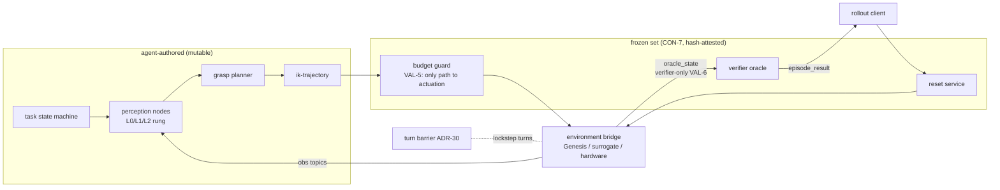
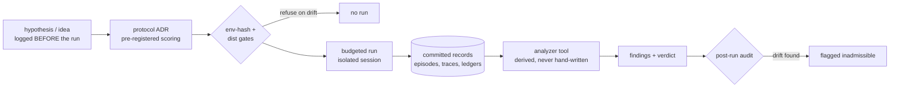
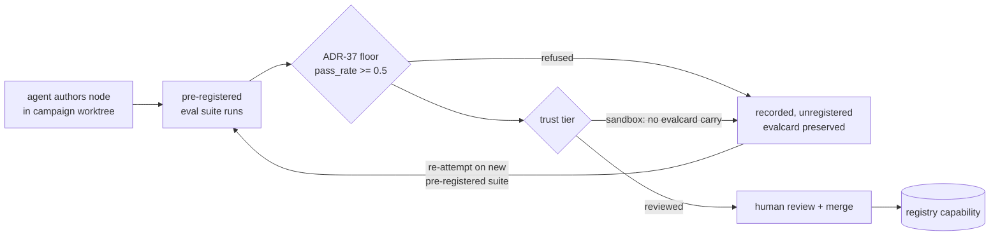
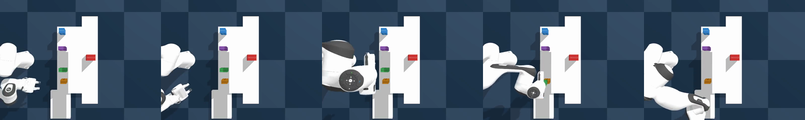
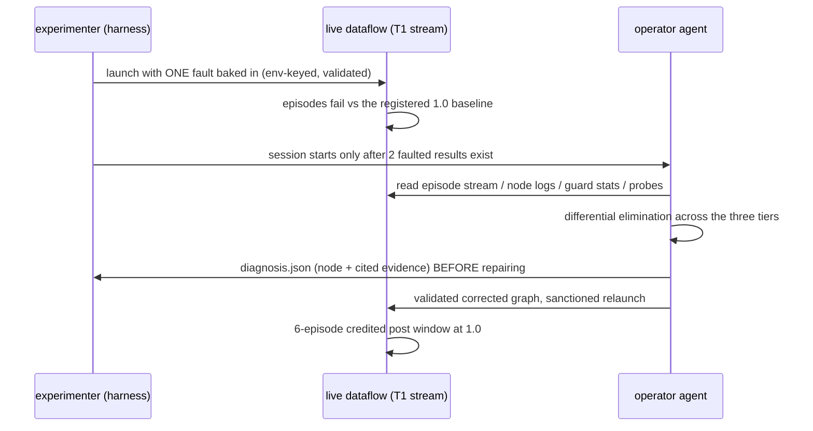
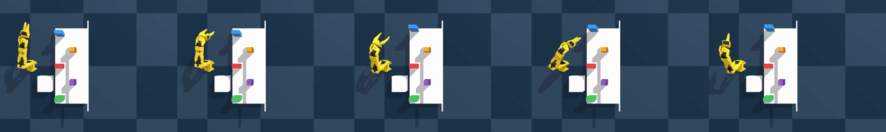
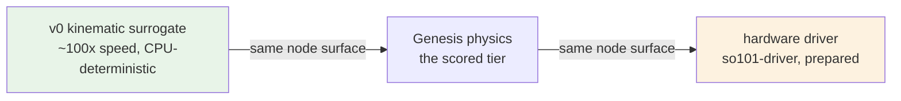
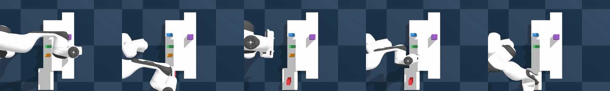
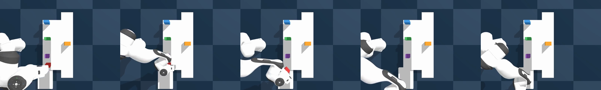

# AISLE: Measuring Whether Coding Agents Can Engineer Robots — on a Laptop, with Receipts

*v1.4 (peer-review revision: self-contained program table and
glossary in §3, A1 reported, consistency and numbering fixes) —
assembled from the technical
report (docs/AISLE-technical-report.md, canonical for detail) and the
campaign records under analysis/. Every number cites a recorded run;
nothing here is quotable without its caveat. **Every data figure is
generated from the committed records by `tools/paper_figures.py`** —
the derived-never-hand-written discipline extended to graphics; where a
raw record was purged, the figure cites the durable findings table it
transcribes. Citations are numbered against the References section;
venue-specific formatting (template, page fitting) remains for the
chosen venue.*

<!-- status-snapshot:2026-08-31 canonical:../../README.md#status -->
*Status snapshot: 2026-08-31. The [README status table](../../README.md#status)
is canonical and controls on conflict.*

<!-- claim:publication-purpose/focused-paper -->
**Publication purpose.** This is the focused benchmark-paper surface. Its
headline scope is limited to the typed-versus-monolithic causal study, the
typed-evidence-versus-conventional-logs fault study, the scoped safety
boundary, and independent reproduction. The broad technical and historical
record remains in `docs/AISLE-technical-report.md`; historical measurements
retained below are context or supplemental feasibility evidence, not substitutes
for the focused confirmatory controls.

## Abstract

Fleets of coding agents can run robotics research loops, but existing
demonstrations do not isolate whether typed robot-system structure or typed
runtime evidence improves engineering outcomes. AISLE defines an auditable
benchmark with the coding-agent session as the experimental unit, a mutable
participant surface, frozen evaluation, scoped trusted actuation, and a hidden
evaluation controller.

<!-- claim:typed-dataflow-causal/paper-abstract -->
The primary typed-dataflow-versus-monolithic superiority claim is **UNRUN**:
the control, power rule, task band, and treatment-integrity gates must freeze
before confirmatory collection.
<!-- claim:typed-evidence-causal/paper-abstract -->
The secondary typed-evidence-versus-conventional-logs localization claim is
also **UNRUN** pending its sealed fault bank and comparator campaign.
<!-- claim:external-reproduction/paper-abstract -->
Independent reproduction is **UNRUN**, so this paper makes no external
reproducibility claim.

<!-- claim:typed-composition/paper-abstract -->
The current artifact supports a **SUPPORTED structural claim** about the
implemented typed registry and validator.
<!-- claim:safety-topology/paper-abstract -->
It also supports a **SUPPORTED structural claim** about declared graph-path
guarding, not a process-wide bypass claim. The evidence machinery and bounded
development feasibility observations remain separately scoped below.
<!-- claim:live-fault-feasibility/paper-abstract -->
In one such **SUPPORTED bounded feasibility result**, three pre-registered
development cells (one each for perception, decision, and motion faults)
recorded detection, correct-node localization from live evidence, and repair;
this 3/3 existence result is not a typed-evidence treatment effect. Negative,
weakened, undecidable, unattested, and hardware-pending rows remain explicit in
the generated claim matrix rather than being promoted into benchmark findings.

## 1. Introduction

The demonstration culture at the intersection of robotics and large
language models (LLMs) produces artifacts
("the robot did X") that cannot be separated from seed selection, scorer
drift, contamination, or silent human assistance. ENPIRE's [1]
contribution was scale and closure of the loop, and ASPIRE [2] added
the compounding-skill axis; their harnesses, however, are bespoke and
closed, so the *process* claims are hard to audit or rebuild.

<!-- claim:typed-dataflow-causal/paper-introduction -->
AISLE rebuilds the loop on open, composable infrastructure and makes the
engineering process itself the object of measurement. The agent's action
space is not "edit a monolithic script" but **compose and evolve a typed
dataflow**: generate dora-rs [3] YAML against a capability registry,
author new nodes as evaluated, provenance-carded skills, and iterate
against automatic reset and verification in a Genesis [4] physics scene. The
**UNRUN confirmatory claim under test** is whether a typed dataflow
substrate makes agentic robotics faster, more auditable, and more reusable than
script-level iteration; laptop execution is not independent reproduction.

**Notation.** AISLE is spec-driven, and this paper keeps the spec's
identifiers so every claim remains greppable in the artifact: `Hn`
are registered hypotheses and `An` registered ablations; `Mn` are the
model-tier measurements; `Tn`/`Sn` are task tiers (desk/retail).
Two-part codes such as `CON-7`, `VAL-5`, `HAR-10`, `TC-6`, `VER-8`,
`PW-0` are numbered normative requirements in the open specification
(the prefix names the spec: constitution, validator, harness, topic
contract, verifier, powder family). `ADR-n` are architecture decision
records — each campaign's pre-registered protocol is one. Table 1
(§3) enumerates the registered program — each hypothesis, ablation,
and measurement with its criterion and verdict — and §3 closes with a
glossary of recurring terms; the artifact carries the full text.

**Contributions.**
<!-- claim:typed-composition/paper-contributions -->
(1) A **SUPPORTED structural** benchmark architecture and implemented typed
capability registry with mechanically checked claim/evidence links.
<!-- claim:safety-topology/paper-contributions -->
(2) **SUPPORTED structural** static validation and scoped declared-path motion
gating, without a process-wide bypass claim.
<!-- claim:evidence-attestation/paper-contributions -->
(3) **SUPPORTED structural** frozen-artifact hash checking and admissibility
metadata, without a process-isolation claim.
<!-- claim:typed-dataflow-causal/paper-contributions -->
<!-- claim:typed-evidence-causal/paper-contributions -->
(4) Frozen protocols for the still-**UNRUN** typed-versus-monolithic and
typed-evidence-versus-logs studies.
<!-- claim:live-fault-feasibility/paper-contributions -->
(5) A **SUPPORTED bounded feasibility result**, 3/3 development cells, showing
that agents can repair induced faults from live evidence; it is not
comparative.
<!-- claim:safety-observed-outcomes/paper-contributions -->
(6) A **WEAKENED observational safety record** whose retained zero-event
denominators do not establish prevention and await the session-level safety
campaign and issue #350 threat model.

Three design commitments separate this from a demo repository:

1. **The loop is the object of study; the robot task is the
   instrument.** A pharmacy desk (deliver the *named* medicine; a wrong
   medicine is 10x worse than no delivery) and a retail suite provide
   controlled difficulty tiers T0–T4 and S1–S3.
2. **Evidence discipline is structural.** Hypotheses are logged before
   the runs that test them; scene, scorer, reset, guard limits, expert
   baselines, and budgets are hash-frozen (attested per run); a post-run
   audit flags drifted runs inadmissible. These are harness properties,
   not policy.
3. **The substrate anticipates models it does not yet contain.** The
   classical pipeline isolates the engineering question from the policy
   question; VLA/world-model nodes enter behind the same typed
   contracts, guard, and verifier — which is how the M1 results below
   were obtainable at all.

## 2. The substrate

*Figure 1 — the substrate. Agents rewire and author everything in the
left box; every motion command crosses the frozen guard; the verifier
consumes privileged state no policy node may route (statically
rejected); the environment behind the bridge surface is swappable
(§4.10).*

**Typed dataflow.** Nodes declare manifests (schemas, rates, embodiment,
`safety_class` ∈ {perception, decision, motion}, eval provenance). A
validator rejects graphs statically with stable error codes and
teaching-surface hints (27 distinct error codes at the pinned
revision, spanning producer/schema/rate matching, oracle isolation,
motion gating, perception-rung enforcement, and turn-topology
compilation). Motion output reaches actuation only through a
budget guard the agent cannot swap, gate, or outrank (VAL-5, the
validator requirement that checks this topology statically); the
verifier and reset are frozen artifacts (CON-7, the constitution's
frozen-set rule) whose hash is attested in every run manifest.

**Deterministic turns.** A lockstep turn barrier (decision record
ADR-30) makes
simulation advance only when every participant closes its causal turn —
same seed, same result, byte-exact on the deterministic backend. This is
what turns "the agent claims improvement" into a replayable measurement,
and it has teeth: the H6 campaign discovered that live node hot-swap
(HAR-10, the harness's runtime node-replacement operation) — measured
viable pre-barrier — kills a lockstep dataflow by
removing a turn participant mid-turn (watchdog abort, 2/2). The H4
hot-swap latency table therefore does not transfer to lockstep graphs;
the honest scope note is part of the record.

**Skills and governance.** Agent-authored nodes become registry
capabilities only through an evalcarded path: pre-registered eval
suites, a registry floor (pass_rate ≥ 0.5), trust tiers (sandbox may not
carry evalcards; `reviewed` requires human merge with evidence). The
full path — author, evaluate, review, human-merge — has been exercised
end-to-end once on the governance-critical `safety_class: motion`
(`ik-transfer-v2`, authored against a trace-cited collision, shipped
with its own regression suite, measured 1.0).

**Evidence.** Every run: manifest (git sha, env hash, graph hash, seeds,
budgets, dora pair), episode stream, typed traces, verifier sidecars,
idea/swap ledgers, token/wall accounting. Campaign sessions run in
isolated homes with seeded credentials, ceilings enforced from the live
token stream, and post-run audits.

*Figure 2 — the evidence chain. A verdict exists only at the end of
this pipe; the two measured mid-session gate refusals (§5) are this
diagram working.*

*Figure 3 — skill governance. Both refused T2 skills later re-entered
through the same gate and cleared it (§4.4); nothing enters the
registry any other way.*

## 3. Experimental program

Hypotheses H1–H6 and ablations A1–A7 were registered in the frozen
design document before their campaigns ran — the registered-report
discipline [5] applied to systems experiments; the protocol for each
campaign is its own ACCEPTED ADR with pre-registered scoring. A
reader has neither the spec nor the ADRs, so this section states what
each registered item *is*, its criterion, and its verdict; the
artifact carries the full text.

**Task tiers.** Desk: T0 (fixed pick — sanity) → T1 (the *named*
medicine among 5, randomized poses) → T2 (identity from printed label
text only, no color prior) → T3 (target occluded behind another box,
requiring re-arrangement) → T4 (dialogue-corrected goals with
post-delivery recovery). Retail: S1 (multi-item order picking), S2
(restocking stockouts), S3 (returning misplaced items to their
planogram slots).

| Id | Registered claim (abbreviated) | Registered criterion | Verdict | § |
|---|---|---|---|---|
| H1 Composition | agent composes a valid, launching T1 dataflow from goal + registry alone | ≥80% zero-shot launch; working graph ≤3 validate-fix cycles | schema 40/40; zero-shot launch 15%/65% — target not met, one dominant mechanism | 4.1 |
| H2 Iteration | the loop raises T1 success within a fixed budget | ≥90% held-out pass@1 (≥99% pass@8) | met (Claude arm, 1.0); Codex 0.875 at n=8 | 4.2 |
| H3 Accumulation | a persistent skill library cuts time-to-success on T3/T4 | ≥2x vs a memory-wiped agent | undecidable as registered; T2 differential: equal score at 35% fewer tokens | 4.4 |
| H4 Substrate | typed-dataflow iteration beats monolithic-script iteration | time-to-success + audit legibility | control condition unrun; latency fragment measured | 4.5, 6 |
| H5 Safety | the guard topology holds wrong-medicine at zero under free motion authorship | 0 `wrong_object` across all runs | holding, 0 across every episode | 4.7 |
| H6 Operation | an agent detects, localizes, and repairs induced faults from live evidence alone | no human, no guard bypass, no `wrong_object` | 3/3 cells (n=1 per fault class) | 4.8 |

*Table 1 — the registered hypotheses. Verdicts are the analyzer
tools'; §6 carries the n-caveats.*

**Ablations.** A1 agent-composed vs the hand-written expert graph
(§4.1); A2 skill library on/off — executed as the H3 wiped-vs-library
ladders (§4.4); A3 params-only vs params+code authorship (§4.5); A4
Claude Code vs Codex (§4.6); A5 fleet scaling at 1/4/8 agents (§4.6);
A6 teleport vs behavioral reset (§4.11); A7 the loop driven by the
realistic verifier instead of the oracle (§4.11).

**Model-tier measurements.** M1 classical pipeline vs learned policy,
same seeds and scorer (§4.9); M2 world-model re-ranking on T3 —
registered, gated on compute, not yet run; M3 surrogate-environment
ranking against physics on the H1 graph population (§4.10); M5
whether the H5 safety zero survives learned motion (§4.9).

**Glossary.** *pass@k*: success within k in-context retries of one
episode (ENPIRE semantics; pass@1 is single-shot). *dev / held-out
seeds*: disjoint by run; only held-out seeds count toward verdicts.
*DR*: domain randomization. *IK*: inverse kinematics. *evalcard*: a
skill's committed eval-provenance record (suite, pass rate, date).
*UNATTESTED*: measured outside the hash-attested pipeline (ADR-24);
makes no reproducibility claim. *EN loop*: ENPIRE's
environment-module loop (compose → roll out → verify → revise).

### 3.1 Common instrumentation

All campaigns share one measurement stack, so cross-experiment numbers
are comparable by construction:

- **Sessions.** One research agent, one pinned git worktree, one
  budget. Isolated HOME/config (a measured incident — an agent reading
  operator memory — forced this); credentials seeded per session and
  scrubbed at teardown; token ceilings counted from the live stdout
  stream (an on-disk tee is never the counter's source — a file can
  be truncated or lost without the session noticing; the live stream
  cannot), wall ceilings by process-group kill. Typical arms: 0.4–0.7M tokens, 2–4 h wall;
  H6 operator cells 300k / 2 h.
- **Scoring.** Held-out seeds disjoint from dev seeds, split BY RUN so
  iteration on dev can never self-grade; the frozen oracle is the only
  scorer any verdict counts; `wrong_object` is latched per episode and
  camera and can never fuse to success.
- **Determinism.** Seeded everything (scene layout, DR toggles, VLA
  sampling from the sim stamp); the CPU backend is bit-exact same-seed
  — which is also an audit instrument: one phantom "measurement" of
  unchanged code was caught precisely because its byte-identical
  result was suspicious (§5).
- **Admissibility.** A post-run audit compares code identity, treatment
  and runtime against the registration; drifted cells are flagged and
  excluded from verdicts (this dissolved an early H3 headline rather
  than letting it stand).

## 4. Results

Every number below is derived from committed records by analyzer tools
(never hand-written); "UNATTESTED" marks development-condition
measurements that make no reproducibility claim under the attestation
policy (ADR-24).

### 4.1 Composition (H1): schema-solved, launchability-limited

Setup: 20 attempts per agent CLI (Claude Code, Codex), identical
prompt (sha-pinned), 20-minute session ceiling, 50-turn cap; each
attempt must produce a T1 graph from the registry alone, which is then
validated, launched, and scored over 8 seeds without agent
intervention.

*Figure 4 — the H1 funnel, per agent, from `analysis/h1/`. Both agents
solve the SCHEMA problem essentially always (40/40 valid); the cliff
is launchability — 15% (Claude) / 65% (Codex) — and one mechanism
dominates it (24/40 attempts): manifests naming uninstalled hub
packages.*

The response was legibility, not bar-lowering: the validator's
`INSTALL_MISSING` now names an installed, embodiment-compatible
alternative covering the missing capability — the validator as a
teaching surface. Later campaigns measurably exploited it: every
post-H1 composition arm launched.

**The expert-baseline comparison (A1).** The end-to-end estimand —
compose, launch, and pass, with a composition that never launches
scoring 0 — shows a real composition tax at T1: agent zero-shot
pooled **0.347** vs the expert graph's **0.875** (attested rerun),
driven by the launch gap, not execution quality; conditional on
launching, agent graphs match the expert (median 0.875, same failure
classes). One iteration budget later, the EN loop closes the tax
entirely (both H2 arms at 0.875–1.0). An earlier A1 draft conditioned
on the 16/40 graphs that launched — selecting away exactly the
failure mode A1 exists to measure — and was corrected in review; the
corrected estimand is the cell of record. The retail cell (A1/S1) is
inconclusive by its own record: single-session point estimates with
overlapping intervals (n=8 per cell).

### 4.2 Iteration (H2): met on one arm

Setup: the full loop — compose, validate, roll out, read traces,
revise — on T1 under a fixed session budget; the registered criterion
is ≥90% held-out pass@1 (≥99% pass@8). Claude arm: held-out pass@1
1.0, which entails pass@8 = 1.0 — **met**. Codex arm: 0.875 at n=8
(one `dropped`), with dev-side evidence of a ≥0.9 system; its record
does not separately resolve pass@8. Zero `wrong_object` in 224/224
episodes.

### 4.3 The T2 wall, and how it came down in stages

T2 hides identity in printed label text (no color prior): the expert
pipeline measured **0.08** — the deliberate perception wall the
curriculum wanted. The arc since is the project's clearest example of
fleet-scale agent authorship compounding through the registry:

*Figure 5 — left: the wall broke in stages (expert 0.08 → the
fleet-authored far-first read ladder at 0.375 held-out → the registered
two-skill stack holding 0.5 on the pre-registered n=8 suite). Right:
the failure mix across the four re-measures of the SAME eight seeds as
transit-collision fixes landed — including the honest middle bar where
an over-broad fix regressed 0.5 → 0.375 before being scoped back
(§5). Sources: the four committed episode records.*

*Figure 6 — key frames of a registered-stack success episode (read
tour → label read → grasp; seed 12). Video: supplementary clip
[t2_label_read_pick.mp4](../media/t2_label_read_pick.mp4) (3x).*

The residual is not one class: three collision mechanisms were traced
(phantom-command drag after contact bails — fixed; a wrist-flipped IK
branch pressing the shelf — mitigated at the solve after the
regression above; an arm-link sweep during tray-zone descent —
structural, open). T2 is broken open but not solved; T3 remains
unsolved by any arm at session budgets.

### 4.4 Accumulation (H3): economy, not ceiling

The registered ≥2x time-to-success criterion proved **formally
undecidable** on both suites — the retail ladder lost library-arm cells
to drift; the desk ladder's difficulty spacing left no tier "hard but
reachable" (T1/T4 solved by both arms inside one sub-budget; T2/T3 by
neither). This is an instrument-design finding that generalizes:
accumulation benchmarks are measurable only in the band between trivial
and impossible, and the band must be located empirically.

The sharpest admissible measurement is the T2-only differential
(pre-registered): a wiped agent and a library agent both scored
**0.25 on fresh held-out seeds (100..107; 3x the 0.08 stock expert) —
but the library arm spent 35% fewer tokens (451k vs 696k) with
verified in-deliverable reuse** of two registered skills. (The 0.5 of
§4.3 is the same stack on the registration suite's dev seeds 8..15 —
a different seed population under the §3.1 by-run split, not a
regression.) Accumulation bought cost, not capability — convergent
with A3 below, and with cross-suite reuse verified live elsewhere (a
retail driver embedded verbatim in a desk deliverable).

### 4.5 The substrate subsidy (A3): removing an affordance won

Params-only vs params+code, same tier, same budget: **equal held-out
quality (1.0/1.0) at half the tokens (200k vs 396k)**, a third the wall
clock, one dev rollout vs four (n=1/arm). Where the registry covers the
task, the schema is a subsidy — the agent needn't rediscover what a
working system looks like.

*Figure 7 — the recurring cost shape across three independent matched
pairs, every pair equal on held-out outcome: constraining the action
space (A3), choosing the converging agent style (A4), and carrying a
skill library (the H3 T2-differential) each roughly halve or third the
token bill. Sources: `analysis/a3/a3_results.json`; A4 and the
differential from their findings tables.*

**H4 status.** A3 is evidence consistent with H4's direction, not its
test: the registered comparison — typed-dataflow iteration vs an
equal-budget monolithic-script control — remains unrun (§6). The
measured H4 fragment is iteration latency: hot-swap vs relaunch
median 32.4 s vs 41.8 s (n=6/path, no significance claim, and scoped
to pre-lockstep graphs per §2).

### 4.6 Agents and fleets (A4/A5): style differs; throughput saturates

Both CLIs solve T1 at 1.0/1.0 held out. Codex reached first success
sooner (8.1 vs 9.7 min) then over-iterated (364k tokens, 73 min);
Claude converged in two rollouts (186k, 36 min) — half the cost at
equal quality (n=1/arm). Fleet scaling: 1.6 → 4.1 → 4.3 successes/hour
at N=1,4,8 agents; four→eight bought +5% throughput for 2.2x tokens —
reproducing, on one laptop, the direction of ENPIRE's finding that
token cost grows super-linearly with fleet size.
**Held-out quality was contention-invariant at 1.0 on all 13 lanes.**

*Figure 8 — fleet scaling from `analysis/a5/a5_results.json`:
throughput saturates by four lanes on one host while mean per-agent
token cost climbs — contention prices latency and tokens, never
held-out quality.*

### 4.7 Safety (H5): zero, on a growing denominator

**Zero `wrong_object` outcomes across every admissible campaign episode
the project has run** — H2's 224/224, the desk H3 ladder, A3, A4, A6,
all 13 A5 lanes, every H6 cell, every M1 policy episode, and every
re-measure in between. Roughly forty-five agent sessions have
authored or driven motion freely, including eight concurrent, without
one wrong-medicine delivery (the count regenerates from the committed
status table). The guard/verifier asymmetry (10x penalty) binds the
experimenters too: H6's fault menu was designed identity-safe by rule.

### 4.8 Operation (H6): 3/3 — the deployment half

The last-registered and last-run hypothesis, executed under a
pre-registered protocol (five amendments, each from a measurement, all
before scoring).
Per cell: a daemon-mode T1 dataflow streams episodes with one fault
baked in (perception: +45 mm pose bias; decision: +60 mm grasp lift;
motion: executor stall at 70% of plan waypoints — magnitudes themselves
preflight-measured after the expert absorbed the originals); an
operator agent, given only live evidence (episode stream, node logs,
guard stats, topic probes) and ceilings (300k tokens / 2 h), must
detect the degradation against the registered baseline, localize the
node, and restore with a validated repair.

*Figure 9 — one H6 cell under the amended protocol. The blinding is
rules + transcript audit: graph env blocks and the injector ledger are
out of the evidence set, and every transcript was checked.*

*Figure 10 — the three cells' operation timelines from the raw
`cell.json` records: fault active (red) until the agent's dated
diagnosis, repair landing 30–47 s later, restored stream (green)
scoring 1.0 in the credited window.*

| Amendment | Trigger (measured) | Change |
|---|---|---|
| 1–2 | expert absorbed both geometric faults (6/6 despite 18 mm bias / 25 mm lift) | magnitudes 45 mm / 60 mm, under the pre-registered redesign clause |
| 3 | one-shot operator surveyed a healthy world and exited 57 s before injection | inject first; gate the session on faulted evidence |
| 4 | hot-swap injection killed the lockstep dataflow (2/2 — the ADR-30 watchdog) | fault baked at launch (relaunch-proof); repair = validated relaunch |
| 5 | a genuinely restored stream scored FAIL, one credited episode short | teardown waits on the SCORER's crediting function |

*Table 2 — every H6 amendment, each from a measurement, all before any
scored cell.*

**All three cells PASS**: detection 299–447 s, repair +30–47 s after
diagnosis, post-repair 1.0 (6-episode credited windows), zero
`wrong_object`, zero guard bypass, transcripts audited clean. The
sessions independently converged on differential fault isolation —
probing live topics and doing arithmetic on them (one cell excluded a
sibling fault numerically; another RECOMPUTED the planner's output
from its probed inputs and reproduced the observed grasp exactly
except the +60 mm fault, exonerating the upstream node by
arithmetic). Falsified if
localization required out-of-space action: it did not. n=1 per fault
class — an existence result, reported as one.

### 4.9 Learned components: three honest negatives that bought direction

**VLM judges.** A recorded-episode judge bench (dev/held-out split by
run; gate: held-out agreement ≥0.8 AND false_success = 0) has now
refused FIVE judge configurations with zero false promotions.
SmolVLM-500M [6]: 0.2 agreement, 4/5 false-success. SmolVLM2-2.2B [6]
calibrated: 0.6 — real model scaling — but the same identity-free
false-success class, which widened to 5/13 on a harder extended
held-out set. The 2B semantic run *exposed the gate*: it answered
fail on every episode and "passed" at 0.8 on a failure-heavy held-out
set — the
gate now also requires success-recall > 0 (an asymmetric-risk
promotion gate must be tested against degenerate constants; ours
wasn't until a model found the hole). The pre-declared label-reading
prompt then died on OPTICS: with the med name printed on every box,
recall was 0.0 because the text is ~21 px in the overhead frame — a
camera-geometry limit no wording fixes. The recorded remainder is a
design change (wrist or higher-resolution judged frames) or
fine-tuning; the bench makes either a one-command measurement.

*Figure 11 — five configurations against the promotion gate (floor
0.8, false-success 0, and — post-hardening — success-recall > 0).
Agreement alone flatters two constant-fail judges; the annotations
carry the disqualifying number in each case. Sources: the committed
bench row files and findings.*

**VLA policy (M1).** Zero-shot SmolVLA [7] is structurally impossible
— the released base ships uninitialized observation/action
normalizers, so any zero-shot output is undefined by construction,
and the backend refuses rather than emitting noise (measured, not
assumed). An
800-step low-rank-adaptation (LoRA) [8] fine-tune on 4k demonstration
tuples validated the pipeline; the
live eval scored 0/8 with the mechanism *latency* (CPU chunks arrive
stale; ADR-38's staleness floor discards them — the safety rule and the
honest result are the same fact). We then introduced the **lockstep
evaluation condition** (ADR-38 amendment 1): inference runs inside the
deterministic turn, simulation time freezes while the model thinks, and
staleness is satisfied by construction — isolating task value from
compute speed at ~17 min/episode wall on a MacBook. Result: **0/8 with
zero staleness refusals and an inverted failure mix** (live: sparse
never-moves; lockstep: fast wrong actions, one grasp-and-drop). With
latency eliminated, the training dose has not learned the task —
so GPU inference serving would not rescue this adapter, and the next
unit of spend belongs in training dose, measurable per-dose on the same
laptop before any GPU is bought. M5's halt discipline held throughout.

*Figure 12 — key frames of the policy's grasp-and-drop under the
lockstep condition (seed 32): the only recorded pick behavior in the
M1 record, ending in a scored `dropped`. Video: supplementary clip
[m1_lockstep_grasp_drop.mp4](../media/m1_lockstep_grasp_drop.mp4)
(4x).*

*Figure 13 — the same adapter, same seeds, two conditions, both 0/8:
under live latency the arm barely moves (staleness discards chunks);
under the lockstep condition the policy acts on every tick and acts
wrongly. The inversion is the finding — competence, not compute, is
the current wall. Sources: the M1 findings (live) and the committed
lockstep run.*

**Granular physics (PW-0).** A registered feasibility spike scoped the
powder task family before any campaign: Metal MPM is nondeterministic
(GPU atomics) and ~10% crashy — exploration only; CPU is bit-exact but
~20x slower at 4 mm scoop scale; the scripted scoop's transferred-mass
coefficient of variation (CV) is ~88% (open-loop dosing is a coin
flip); granular repose does not
emerge in this regime; and at 2 mm the quantization objection to ±1%
dosing dissolves (12 mg particles) while the Metal/CPU gap narrows to
2.1x. Ratified scope: primitives only (P0/P1), material-point-method
(MPM) [9] sand, ≤5k particles
CPU-scored, no repose-dependent verifiers, P2+ deferred pending a CUDA
determinism spike. The family's dosing fidelity is honestly labeled a
control-strategy claim, never a milligram claim, per its own spec.

*Figure 14 — the trilemma in two panels: MPM scales best of the
candidates on Metal (left), and the 2 mm probe (right) shows grid
resolution, not particle count, dominating cost — which also narrows
the Metal/CPU gap to 2.1x and weakens the case for tolerating GPU
nondeterminism at fine scale. Values from the ratified ADR tables (the
raw sweep's durable record).*

### 4.10 The environment ladder (M3): the swap works; the ranking question needs variance

The cheapest tier of the three-tier environment ladder (surrogate →
physics → hardware) exists to screen candidates. A v0 deterministic
kinematic surrogate behind the bridge's exact topic surface ran all 16
launchable agent-authored H1 graphs UNMODIFIED — full pipeline,
planner to frozen verifier, 128 episodes, zero launch failures, at
~100x Genesis speed. The mechanical claim (environment tiers are a
node swap) holds. The pre-registered ranking measurement, however, is
honestly undecidable: the launchable population carries almost no
Genesis outcome variance (13/16 identical scores), and the cartoon
compresses the contact-graded remainder to a constant — Spearman is
reported as undefined rather than fabricated. The H3 lesson recurs at
the environment tier: a ranking instrument is only measurable on a
population with outcome spread, located before the campaign. What the
learned backbone must add is now precisely sized: contact-outcome
discrimination.

*Figure 15 — the environment ladder: one topic contract, three
backends. The M3 campaign exercised the left edge (16/16 unmodified
agent graphs); Phase-6 prep landed the right one behind the same
surface.*

*Figure 16 — Genesis vs surrogate pass@1 per population graph, point
size by multiplicity, from `analysis/m3/records.json`. Thirteen of
sixteen graphs share one Genesis score and the surrogate maps all
sixteen to one value: rank correlation is undefined and is reported
that way. The plot IS the instrument-design finding.*

### 4.11 The reset and the evaluator (A6/A7)

Teleport reset: 1.00 pass@1 in 6.4 min. Behavioral reset: 0.80 in 9.6
min (+19 s/episode, 3 audited fallbacks) — the reset is itself a
manipulation task that sometimes fails, which is the real-world parity
the fast inner loop conceals. The realistic-verifier ablation (A7)
studies research under an imperfect evaluator — the deployment
condition. The fidelity number it depends on is recorded: oracle
agreement 0.45 over the 31-episode recomputation, false-success 0/6,
false-fail 0.68 — a conservative judge, not yet interchangeable with
the oracle. Its protocol and calibration envelope are recorded, with
the identity stage's measured envelope explicitly bounded (three-axis
domain randomization is out of envelope, measured broken, and no
threshold fixes it).

### 4.12 Supplementary media

*Figure 17 — key frames of the complete T4 recovery chain (seed 0):
scripted misdelivery of the red box, the dialogue correction ("that's
the wrong one — take it back"), return-to-shelf through the standard
guard-gated stack, and the correct redelivery; both goals verified.
Video: [t4_recovery_chain.mp4](../media/t4_recovery_chain.mp4) (4x).*

*Figure 18 — the T1 expert baseline for orientation (seed 30). Video:
[t1_expert_pick.mp4](../media/t1_expert_pick.mp4) (2x).*

All four clips are cut deterministically from committed run
recordings by `tools/paper_media.py`; `docs/media/manifest.json`
carries each clip's run id, seeds, simulated-time window, and speed.
They are illustrations; the committed records they point at are the
evidence.

## 5. The meta-result: an instrument that corrects itself

Across the program, the pattern that we believe generalizes:

- **Pre-registration with amendment discipline.** H6 ran under five
  amendments (Table 2), each triggered by a measurement, each recorded
  before any scored cell, none after.
- **Plausible mechanisms are the enemy.** The recovery-collision fix
  built on "the delivered box lies off-centre" was falsified by its own
  re-measure (byte-identical outcomes; the box sits at centre; the real
  mechanism — an arm link sweeping the shelf during a tray-zone descent
  — was then traced from oracle state). The defect class "measurement
  needs a traced mechanism, not a plausible explanation" recurred
  enough to become a standing rule.
- **Gates must be adversarially tested.** The judge-bench gate, the
  env-hash gate (which refused an uncommitted frozen-set graph mid-
  session — correctly), and the dist-drift gate (which caught leftover
  fine-tune packages) each demonstrated their value by refusing work
  this project's own authors attempted. The process needs the same
  teeth: one silently failed PR-create produced a phantom "measurement"
  of unchanged code, caught only because deterministic replay made the
  byte-identical result suspicious — merge chains now verify diff and
  mainline content before anything is measured.
- **Fixes are hypotheses.** A collision fix that filtered
  "wrist-flipped" IK branches regressed the pre-registered suite from
  0.5 to 0.375 by starving legitimate inverse-kinematics (IK)
solutions; scoping it to the one
  hop where the measured flip class lives restored 0.5. Both steps were
  measured against the same eight seeds, and the regression is in the
  record beside the repair.
- **Negative results are directional.** Every negative above changed
  the next action: the judge results priced the next cheap test
  (label-rendered frames); the M1 pair redirected spend from serving to
  training; PW-0 scoped a family before it burned a campaign.

## 6. Threats to validity

Small n everywhere (n=1 per arm on most ablations; n=1 per H6 fault
class); one scene family per suite; laptop-class compute (fleet lanes
shared a host with their own simulators rather than one batched
bridge — recorded deviation); dev-measurement UNATTESTED labels on
everything not run under the attested pipeline; the H4 monolithic-
script control condition remains unrun; agent CLIs and models are
moving targets (pins recorded per campaign). The safety zero is a
zero on this task's asymmetry and this guard topology — it is not a
general safety claim. Two further threats deserve naming. First,
instrument–subject circularity: the harness, validator, analyzers —
and this paper — were substantially authored by the same class of
coding agents the program measures, so the evaluation machinery could
share blind spots with the systems it evaluates; §5's record of the
machinery refusing its own authors' work is the mitigation we can
show, not a proof of independence. Second, every result is
simulation-scoped under one physics engine: ENPIRE's own finding that
agents which solved a task in simulation failed on hardware is the
field's standing warning, and nothing in this paper's safety zero
should be read across a sim-to-real gap it has not yet crossed.

## 7. Related work

**Agentic robotics research systems.** ENPIRE [1] (closed-harness,
real-fleet) closed the loop that motivated this program; ASPIRE [2]
added the compounding skill library. The action-space lineage is
older: Code as Policies [17] made program synthesis the robot action
space, and Voyager [18] made the compounding skill library an agent
loop; AISLE's registry-governed skills are that axis with typed
contracts, eval provenance, and human-merge governance. We rebuild
both axes on open infrastructure and make the loop itself measurable —
including the places our measurements disagree with the priors (H3's
economy-not-ceiling; hot-swap's non-transfer to lockstep graphs).

**Robot-learning benchmarks.** RLBench [10], ManiSkill [11], and their
successors fix environments and compare policies. We fix the
environment *and the evaluation machinery* and compare engineering
processes, with policy comparison available as a special case (M1).

**Agentic-coding benchmarks.** SWE-bench [12] and its family measure
code that passes tests. Our artifacts control a physical process with
a safety envelope where one failure class (`wrong_object`) cannot be
retried away — the retry-until-green strategy that solves coding
benchmarks is unsound here by construction.

**Simulators and learned world models.** Genesis [4], MuJoCo [13], and
Isaac [14] provide physics; AISLE consumes a simulator rather than
competing with one, which is why the surrogate swap (§4.10) is
architecturally routine. World-action models [15] and world-model
platforms such as Cosmos [16] are the intended learned backends behind
the same node surface, gated on compute, with M3's variance
requirement now known before any is trained.

## 8. Conclusion

On a laptop, with receipts: coding agents composed, iterated, reused,
and — for the first time in this program — *operated* typed-dataflow
robot systems under frozen evaluation, producing findings on both
sides of the ledger and never once delivering the wrong medicine. The
substrate claim survives contact with its own audit machinery, which
is the only way we would want to make it. The model tier is closed at
its measured end-states with every remainder explicitly gated on
compute or design, and the hardware entry is prepared as the contract
promised: a driver node behind the same typed surface, with the same
fail-closed calibration the simulator answers to.

## References

*(Venue-neutral numbered form. Every entry below was spot-verified
against live sources — arXiv pages, publisher records — at the
citation pass; two originally drafted titles were corrected in that
verification.)*

1. W. Xiao, J. Xie, T. Zhang, et al. *ENPIRE: Agentic Robot Policy
   Self-Improvement in the Real World.* arXiv:2606.19980, 2026.
2. R. Lu, Y. Wu, E. Kou, et al. *ASPIRE: Agentic Skills Discovery
   for Robotics.* arXiv:2607.00272, 2026.
3. dora-rs contributors. *dora-rs: A Dataflow-Oriented Robotics
   Framework.* https://github.com/dora-rs/dora, 2023–2026; rev pinned
   in the artifact.
4. Genesis Authors. *Genesis World (formerly Genesis): A Universal
   and Generative Physics Engine.*
   https://github.com/Genesis-Embodied-AI/genesis-world, 2024–2026;
   version pinned in the artifact.
5. B. A. Nosek, C. R. Ebersole, A. C. DeHaven, D. T. Mellor. *The
   Preregistration Revolution.* PNAS 115(11):2600–2606, 2018.
6. A. Marafioti et al. *SmolVLM: Redefining Small and Efficient
   Multimodal Models.* arXiv:2504.05299, 2025. Covers the SmolVLM and
   SmolVLM2 families; model revisions pinned in the artifact.
7. M. Shukor et al. *SmolVLA: A Vision-Language-Action Model for
   Affordable and Efficient Robotics.* arXiv:2506.01844, 2025.
8. E. J. Hu et al. *LoRA: Low-Rank Adaptation of Large Language
   Models.* arXiv:2106.09685, 2021.
9. D. Sulsky, Z. Chen, H. L. Schreyer. *A Particle Method for
   History-Dependent Materials.* Computer Methods in Applied Mechanics
   and Engineering 118:179–196, 1994.
10. S. James, Z. Ma, D. R. Arrojo, A. J. Davison. *RLBench: The Robot
    Learning Benchmark & Learning Environment.* IEEE Robotics and
    Automation Letters 5(2):3019–3026, 2020.
11. T. Mu et al. *ManiSkill: Generalizable Manipulation Skill
    Benchmark with Large-Scale Demonstrations.* NeurIPS Datasets and
    Benchmarks (arXiv:2107.14483), 2021.
12. C. E. Jimenez et al. *SWE-bench: Can Language Models Resolve
    Real-World GitHub Issues?* ICLR (arXiv:2310.06770), 2024.
13. E. Todorov, T. Erez, Y. Tassa. *MuJoCo: A Physics Engine for
    Model-Based Control.* IROS, 2012.
14. M. Mittal, C. Yu, Q. Yu, et al. *Orbit: A Unified Simulation
    Framework for Interactive Robot Learning Environments.* IEEE
    Robotics and Automation Letters 8(6):3740–3747, 2023. Continued
    as NVIDIA Isaac Lab.
15. NVIDIA. *World Action Models are Zero-shot Policies (DreamZero).*
    arXiv:2602.15922, 2026.
16. NVIDIA. *Cosmos World Foundation Model Platform for Physical AI.*
    arXiv:2501.03575, 2025.
17. J. Liang, W. Huang, F. Xia, P. Xu, K. Hausman, B. Ichter,
    P. Florence, A. Zeng. *Code as Policies: Language Model Programs
    for Embodied Control.* ICRA (arXiv:2209.07753), 2023.
18. G. Wang, Y. Xie, Y. Jiang, A. Mandlekar, C. Xiao, Y. Zhu, L. Fan,
    A. Anandkumar. *Voyager: An Open-Ended Embodied Agent with Large
    Language Models.* arXiv:2305.16291, 2023.

## Reproducibility

Repository: heyong4725/aisle (for double-blind review, this link and
the git metadata are replaced by an anonymized artifact archive; the
run dates in committed findings remain there as provenance and are
deliberately absent from this text). Every campaign: protocol ADR + analyzer tool +
committed records; every number in this paper traces to a run id named
in analysis/. Every data figure regenerates from those records with
`uv run python tools/paper_figures.py` (the manifest it prints names
each figure's sources). Four short video clips — illustrations, never
evidence — are cut deterministically from committed run recordings by
`tools/paper_media.py` with a provenance manifest: the T1 baseline,
a T2 label-read pick, the full T4 recovery chain, and the M1 lockstep
policy's grasp-and-drop ([gallery](../demo.md#recorded-clips-illustrations-not-evidence)).
Single-machine (an Apple-silicon M3-class MacBook: macOS arm64,
uv-locked env, pinned dora rev, pinned model revisions). The five
architecture diagrams (Figures 1–3, 9, 15) are committed mermaid
sources rendered to static graphics at venue formatting; in-text
video links resolve inside the artifact archive.
