# AISLE: Measuring Whether Coding Agents Can Engineer Robots — on a Laptop, with Receipts

*v1.1 (expanded edition), 2026-08-28 — assembled from the technical
report (docs/AISLE-technical-report.md, canonical for detail) and the
campaign records under analysis/. Every number cites a recorded run;
nothing here is quotable without its caveat. **Every data figure is
generated from the committed records by `tools/paper_figures.py`** —
the derived-never-hand-written discipline extended to graphics; where a
raw record was purged, the figure cites the durable findings table it
transcribes. Venue formatting and full citations are submission
mechanics, applied at the venue pass.*

## Abstract

Fleets of coding agents can run the robotics research loop — ENPIRE
demonstrated as much on real hardware with a bespoke, closed harness. We
ask a sharper question on open infrastructure: **can AI coding agents
autonomously build, diagnose, improve, reuse, and safely operate robotic
systems when those systems are composed as typed dataflows** — and can
the answer be *measured* rather than demonstrated? AISLE is a substrate
(typed capability registry, static graph validation, an unbypassable
safety guard, frozen verifiers, hash-attested evidence, budgeted
campaigns) plus a pre-registered experimental program run against it on
a single MacBook. We report: composition is schema-solved but
launchability-limited (40/40 valid graphs, 15–65% zero-shot launch, one
dominant mechanism); iteration reaches held-out 1.0 on the easiest tier;
skill accumulation buys **economy, not ceiling** (equal held-out score
at 35% lower token cost, with verified cross-suite reuse); the substrate
subsidy is real and unintuitive (denying code-authoring *halved* session
cost at equal quality); a fleet saturates at ~4 agents on one host with
quality contention-invariant at 1.0; safety held at **zero
wrong-medicine deliveries across every campaign episode ever run**
(~40 agent sessions authoring motion code freely, 8 concurrent); and —
the deployment half — agents given only live evidence detected,
localized, and repaired induced faults in a running dataflow in **3/3
pre-registered cells** (detection 299–447 s, repair +30–47 s, zero
safety violations, audited transcripts). The negative results are load-
bearing: five VLM-judge configurations refused by an asymmetric-risk
gate that itself needed hardening twice — one model found a scoring
hole, and label-reading prompts died on camera optics, not prompting;
a swappable surrogate environment that ran agent-authored graphs
unmodified at ~100x physics speed while its ranking value proved
honestly undecidable on a variance-free population; a fine-tuned VLA policy
whose live 0/8 measured latency and whose lockstep 0/8 — a measurement
condition we introduce that freezes simulation time during in-turn
inference — measured competence, redirecting the next dollar from GPU
serving to training dose; and a granular-physics feasibility gate that
scoped an entire task family to its measured floor before any campaign
spent tokens on it. The recurring meta-result: with pre-registration,
frozen evaluation, and attested evidence, an agent-driven engineering
loop produces *findings* — including findings against its own
hypotheses and its own instruments — at laptop cost.

## 1. Introduction

The demonstration culture in robotics-plus-LLM work produces artifacts
("the robot did X") that cannot be separated from seed selection, scorer
drift, contamination, or silent human assistance. ENPIRE's contribution
was scale and closure of the loop; its harness, however, is bespoke and
closed, so the *process* claims are hard to audit or rebuild.

AISLE rebuilds the loop on open, composable infrastructure and makes the
engineering process itself the object of measurement. The agent's action
space is not "edit a monolithic script" but **compose and evolve a typed
dataflow**: generate dora-rs YAML against a capability registry, author
new nodes as evalcarded skills, and iterate against automatic reset and
verification in a Genesis physics scene. The claim under test: *a typed
dataflow substrate makes agentic robotics faster, more auditable, and
more reusable than script-level iteration* — reproducible on a laptop.

Three design commitments separate this from a demo repository:

1. **The loop is the object of study; the robot task is the
   instrument.** A pharmacy desk (deliver the *named* medicine; a wrong
   medicine is 10x worse than no delivery) and a retail suite provide
   controlled difficulty tiers T0–T4 and S1–S3.
2. **Evidence discipline is structural.** Hypotheses are logged before
   the runs that test them; scene, scorer, reset, guard limits, expert
   baselines, and budgets are hash-frozen (attested per run); a post-run
   audit flags drifted runs inadmissible. These are harness properties,
   not policy.
3. **The substrate anticipates models it does not yet contain.** The
   classical pipeline isolates the engineering question from the policy
   question; VLA/world-model nodes enter behind the same typed
   contracts, guard, and verifier — which is how the M1 results below
   were obtainable at all.

## 2. The substrate

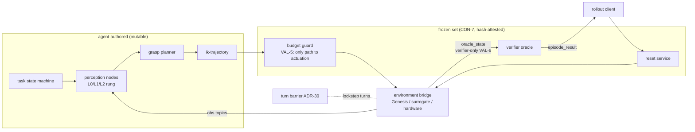

*Diagram 1 — the substrate. Agents rewire and author everything in the
left box; every motion command crosses the frozen guard; the verifier
consumes privileged state no policy node may route (statically
rejected); the environment behind the bridge surface is swappable
(§4.10).*

**Typed dataflow.** Nodes declare manifests (schemas, rates, embodiment,
`safety_class` ∈ {perception, decision, motion}, eval provenance). A
validator rejects graphs statically with stable error codes and
teaching-surface hints (16+ checks: producer/schema/rate matching,
oracle isolation, motion gating, perception-rung enforcement, turn-
topology compilation). Motion output reaches actuation only through a
budget guard the agent cannot swap, gate, or outrank (VAL-5 topology
check); the verifier and reset are frozen artifacts (CON-7) whose hash
is attested in every run manifest.

**Deterministic turns.** A lockstep turn barrier (ADR-30) makes
simulation advance only when every participant closes its causal turn —
same seed, same result, byte-exact on the deterministic backend. This is
what turns "the agent claims improvement" into a replayable measurement,
and it has teeth: the H6 campaign discovered that live node hot-swap
(HAR-10) — measured viable pre-barrier — kills a lockstep dataflow by
removing a turn participant mid-turn (watchdog abort, 2/2). The H4
hot-swap latency table therefore does not transfer to lockstep graphs;
the honest scope note is part of the record.

**Skills and governance.** Agent-authored nodes become registry
capabilities only through an evalcarded path: pre-registered eval
suites, a registry floor (pass_rate ≥ 0.5), trust tiers (sandbox may not
carry evalcards; `reviewed` requires human merge with evidence). The
full path — author, evaluate, review, human-merge — has been exercised
end-to-end once on the governance-critical `safety_class: motion`
(`ik-transfer-v2`, authored against a trace-cited collision, shipped
with its own regression suite, measured 1.0).

**Evidence.** Every run: manifest (git sha, env hash, graph hash, seeds,
budgets, dora pair), episode stream, typed traces, verifier sidecars,
idea/swap ledgers, token/wall accounting. Campaign sessions run in
isolated homes with seeded credentials, ceilings enforced from the live
token stream, and post-run audits.

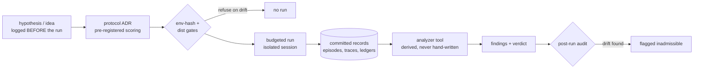

*Diagram 2 — the evidence chain. A verdict exists only at the end of
this pipe; the two measured mid-session gate refusals (§5) are this
diagram working.*

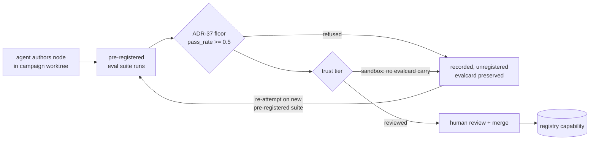

*Diagram 3 — skill governance. Both refused T2 skills later re-entered
through the same gate and cleared it (§4.4); nothing enters the
registry any other way.*

## 3. Experimental program

Hypotheses H1–H6 and ablations A1–A7 were registered in the frozen
design document (July–August 2026) before their campaigns ran; the
protocol for each campaign is its own ACCEPTED ADR with pre-registered
scoring. Tiers: T0 (fixed pick) → T1 (named med among 5, randomized) →
T2 (label-text identification, no color prior) → T4 (dialogue-corrected
goals); retail S1–S3 (multi-item orders, stockouts, planogram swaps).

### 3.1 Common instrumentation

All campaigns share one measurement stack, so cross-experiment numbers
are comparable by construction:

- **Sessions.** One research agent, one pinned git worktree, one
  budget. Isolated HOME/config (a measured incident — an agent reading
  operator memory — forced this); credentials seeded per session and
  scrubbed at teardown; token ceilings counted from the live stdout
  stream (an on-disk tee is never the counter's source), wall ceilings
  by process-group kill. Typical arms: 0.4–0.7M tokens, 2–4 h wall;
  H6 operator cells 300k / 2 h.
- **Scoring.** Held-out seeds disjoint from dev seeds, split BY RUN so
  iteration on dev can never self-grade; the frozen oracle is the only
  scorer any verdict counts; `wrong_object` is latched per episode and
  camera and can never fuse to success.
- **Determinism.** Seeded everything (scene layout, DR toggles, VLA
  sampling from the sim stamp); the CPU backend is bit-exact same-seed
  — which is also an audit instrument: one phantom "measurement" of
  unchanged code was caught precisely because its byte-identical
  result was suspicious (§5).
- **Admissibility.** A post-run audit compares code identity, treatment
  and runtime against the registration; drifted cells are flagged and
  excluded from verdicts (this dissolved an early H3 headline rather
  than letting it stand).

## 4. Results

Every number below is derived from committed records by analyzer tools
(never hand-written); "UNATTESTED" marks dev measurements that make no
reproducibility claim (ADR-24).

### 4.1 Composition (H1): schema-solved, launchability-limited

Setup: 20 attempts per agent CLI (Claude Code, Codex), identical
prompt (sha-pinned), 20-minute session ceiling, 50-turn cap; each
attempt must produce a T1 graph from the registry alone, which is then
validated, launched, and scored over 8 seeds without agent
intervention.

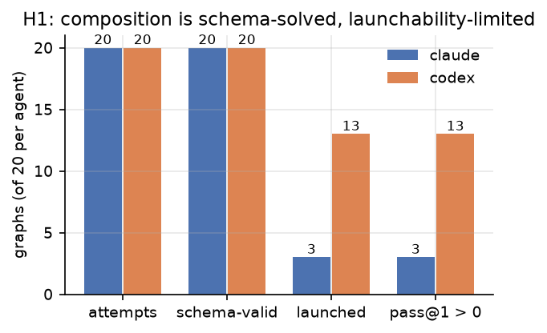

*Figure 1 — the H1 funnel, per agent, from `analysis/h1/`. Both agents
solve the SCHEMA problem essentially always (40/40 valid); the cliff
is launchability — 15% (Claude) / 65% (Codex) — and one mechanism
dominates it (24/40 attempts): manifests naming uninstalled hub
packages.*

The response was legibility, not bar-lowering: the validator's
`INSTALL_MISSING` now names an installed, embodiment-compatible
alternative covering the missing capability — the validator as a
teaching surface, which later campaigns measurably exploited (every
post-H1 composition arm launches).

### 4.2 Iteration (H2): met on one arm

Claude arm: held-out pass@1 1.0. Codex arm: 0.875 at N=8 with dev-side
evidence of a ≥0.9 system. Zero `wrong_object` in 224/224 episodes.

### 4.3 The T2 wall, and how it came down in stages

T2 hides identity in printed label text (no color prior): the expert
pipeline measured **0.08** — the deliberate perception wall the
curriculum wanted. The arc since is the project's clearest example of
fleet-scale agent authorship compounding through the registry:

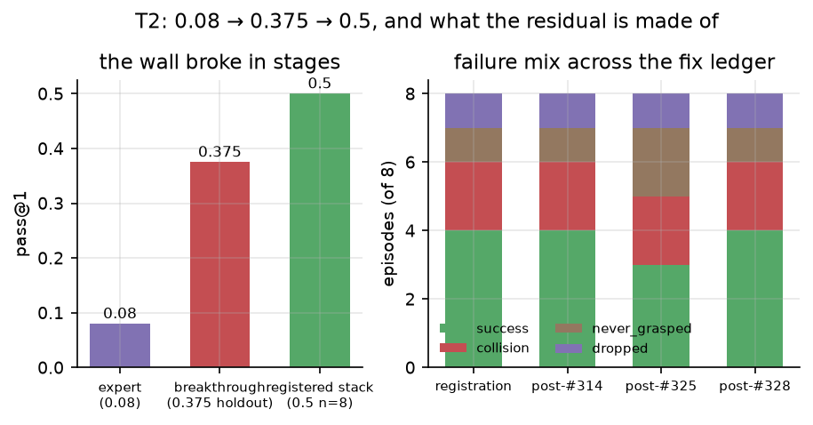

*Figure 2 — left: the wall broke in stages (expert 0.08 → the
fleet-authored far-first read ladder at 0.375 holdout → the registered
two-skill stack holding 0.5 on the pre-registered n=8 suite). Right:
the failure mix across the four re-measures of the SAME eight seeds as
transit-collision fixes landed — including the honest middle bar where
an over-broad fix regressed 0.5 → 0.375 before being scoped back
(§5). Sources: the four committed episode records.*

The residual is not one class: three collision mechanisms were traced
(phantom-command drag after contact bails — fixed; a wrist-flipped IK
branch pressing the shelf — mitigated at the solve after the
regression above; an arm-link sweep during tray-zone descent —
structural, open). T2 is broken open but not solved; T3 remains
unsolved by any arm at session budgets.

### 4.4 Accumulation (H3): economy, not ceiling

The registered ≥2x time-to-success criterion proved **formally
undecidable** on both suites — the retail ladder lost library-arm cells
to drift; the desk ladder's difficulty spacing left no tier "hard but
reachable" (T1/T4 solved by both arms inside one sub-budget; T2/T3 by
neither). This is an instrument-design finding that generalizes:
accumulation benchmarks are measurable only in the band between trivial
and impossible, and the band must be located empirically.

The sharpest admissible measurement is the T2-only differential
(pre-registered, 2026-08-25): a wiped agent and a library agent both
scored **0.25 holdout — but the library arm spent 35% fewer tokens
(451k vs 696k) with verified in-deliverable reuse** of two registered
skills. Accumulation bought cost, not capability — convergent with A3
below, and with cross-suite reuse verified live elsewhere (a retail
driver embedded verbatim in a desk deliverable).

### 4.5 The substrate subsidy (A3/H4): removing an affordance won

Params-only vs params+code, same tier, same budget: **equal held-out
quality (1.0/1.0) at half the tokens (200k vs 396k)**, a third the wall
clock, one dev rollout vs four (n=1/arm). Where the registry covers the
task, the schema is a subsidy — the agent needn't rediscover what a
working system looks like.

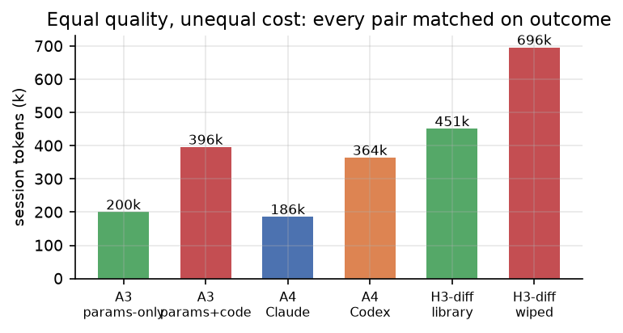

*Figure 3 — the recurring cost shape across three independent matched
pairs, every pair equal on held-out outcome: constraining the action
space (A3), choosing the converging agent style (A4), and carrying a
skill library (the H3 T2-differential) each roughly halve or third the
token bill. Sources: `analysis/a3/a3_results.json`; A4 and the
differential from their findings tables.* Hot-swap vs relaunch iteration latency:
median 32.4 s vs 41.8 s (n=6/path, no significance claim, and scoped to
pre-lockstep graphs per §2).

### 4.6 Agents and fleets (A4/A5): style differs; throughput saturates

Both CLIs solve T1 at 1.0/1.0 held out. Codex reached first success
sooner (8.1 vs 9.7 min) then over-iterated (364k tokens, 73 min);
Claude converged in two rollouts (186k, 36 min) — half the cost at
equal quality (n=1/arm). Fleet scaling: 1.6 → 4.1 → 4.3 successes/hour
at N=1,4,8 agents; four→eight bought +5% throughput for 2.2x tokens,
reproducing ENPIRE's super-linearity direction on one laptop.
**Held-out quality was contention-invariant at 1.0 on all 13 lanes.**

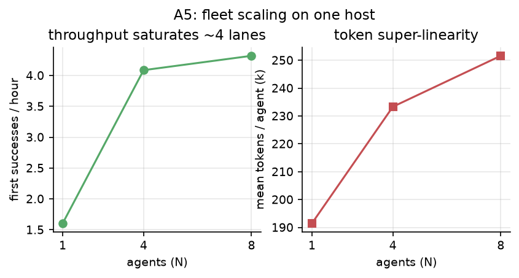

*Figure 4 — fleet scaling from `analysis/a5/a5_results.json`:
throughput saturates by four lanes on one host while mean per-agent
token cost climbs — contention prices latency and tokens, never
held-out quality.*

### 4.7 Safety (H5): zero, on a growing denominator

**Zero `wrong_object` outcomes across every admissible campaign episode
the project has run** — H2's 224/224, the desk H3 ladder, A3, A4, A6,
all 13 A5 lanes, every H6 cell, every M1 policy episode, and every
re-measure in between. Roughly forty agent sessions have authored
motion code freely, including eight concurrent, without one wrong-
medicine delivery. The guard/verifier asymmetry (10x penalty) binds the
experimenters too: H6's fault menu was designed identity-safe by rule.

### 4.8 Operation (H6): 3/3 — the deployment half

Registered August 2026, run 2026-08-25/26 under a pre-registered
protocol (five amendments, each from a measurement, all before scoring).
Per cell: a daemon-mode T1 dataflow streams episodes with one fault
baked in (perception: +45 mm pose bias; decision: +60 mm grasp lift;
motion: executor stall at 70% of plan waypoints — magnitudes themselves
preflight-measured after the expert absorbed the originals); an
operator agent, given only live evidence (episode stream, node logs,
guard stats, topic probes) and ceilings (300k tokens / 2 h), must
detect the degradation against the registered baseline, localize the
node, and restore with a validated repair.

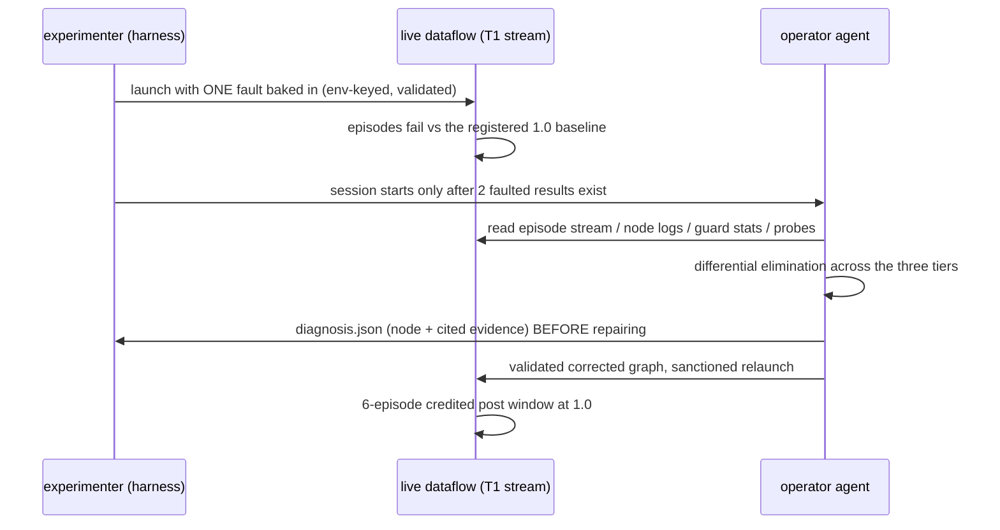

*Diagram 4 — one H6 cell under the amended protocol. The blinding is
rules + transcript audit: graph env blocks and the injector ledger are
out of the evidence set, and every transcript was checked.*

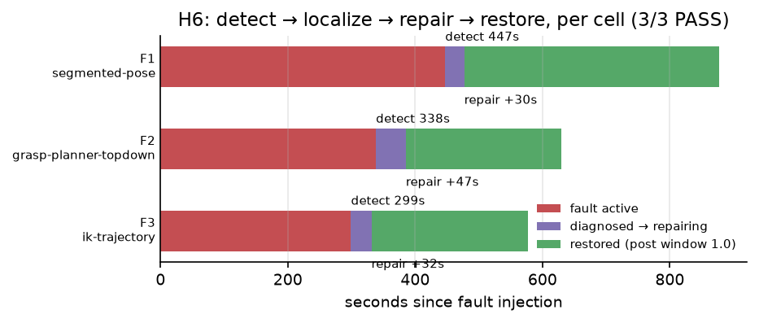

*Figure 5 — the three cells' operation timelines from the raw
`cell.json` records: fault active (red) until the agent's dated
diagnosis, repair landing 30–47 s later, restored stream (green)
scoring 1.0 in the credited window.*

| Amendment | Trigger (measured) | Change |
|---|---|---|
| 1–2 | expert absorbed both geometric faults (6/6 despite 18 mm bias / 25 mm lift) | magnitudes 45 mm / 60 mm, under the pre-registered redesign clause |
| 3 | one-shot operator surveyed a healthy world and exited 57 s before injection | inject first; gate the session on faulted evidence |
| 4 | hot-swap injection killed the lockstep dataflow (2/2 — the ADR-30 watchdog) | fault baked at launch (relaunch-proof); repair = validated relaunch |
| 5 | a genuinely restored stream scored FAIL, one credited episode short | teardown waits on the SCORER's crediting function |

*Table 1 — every H6 amendment, each from a measurement, all before any
scored cell.*

**All three cells PASS**: detection 299–447 s, repair +30–47 s after
diagnosis, post-repair 1.0 (6-episode credited windows), zero
`wrong_object`, zero guard bypass, transcripts audited clean. The
sessions independently converged on differential fault isolation —
probing live topics and doing arithmetic on them (one cell excluded a
sibling fault numerically; another RECOMPUTED the planner's output
from its probed inputs and reproduced the observed grasp exactly
except the +60 mm fault, exonerating the upstream node by
arithmetic). Falsified if
localization required out-of-space action: it did not. n=1 per fault
class — an existence result, reported as one.

### 4.9 Learned components: three honest negatives that bought direction

**VLM judges.** A recorded-episode judge bench (dev/holdout split by
run; gate: holdout agreement ≥0.8 AND false_success = 0) has now
refused FIVE judge configurations with zero false promotions.
SmolVLM-500M: 0.2 agreement, 4/5 false-success. SmolVLM2-2.2B
calibrated: 0.6 — real model scaling — but the same identity-free
false-success class, which widened to 5/13 on a harder extended
holdout. The 2B semantic run *exposed the gate*: it answered fail on
every episode and "passed" at 0.8 on a failure-heavy holdout — the
gate now also requires success-recall > 0 (an asymmetric-risk
promotion gate must be tested against degenerate constants; ours
wasn't until a model found the hole). The pre-declared label-reading
prompt then died on OPTICS: with the med name printed on every box,
recall was 0.0 because the text is ~21 px in the overhead frame — a
camera-geometry limit no wording fixes. The recorded remainder is a
design change (wrist or higher-resolution judged frames) or
fine-tuning; the bench makes either a one-command measurement.

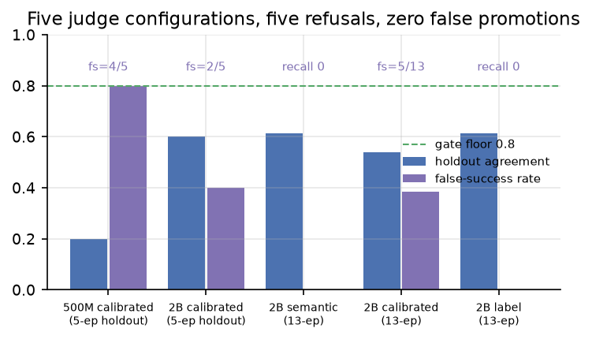

*Figure 6 — five configurations against the promotion gate (floor
0.8, false-success 0, and — post-hardening — success-recall > 0).
Agreement alone flatters two constant-fail judges; the annotations
carry the disqualifying number in each case. Sources: the committed
bench row files and findings.*

**VLA policy (M1).** Zero-shot SmolVLA is structurally impossible (the
base ships uninitialized normalizers) — measured, not assumed. An
800-step LoRA fine-tune on 4k demo tuples validated the pipeline; the
live eval scored 0/8 with the mechanism *latency* (CPU chunks arrive
stale; ADR-38's staleness floor discards them — the safety rule and the
honest result are the same fact). We then introduced the **lockstep
evaluation condition** (ADR-38 amendment 1): inference runs inside the
deterministic turn, simulation time freezes while the model thinks, and
staleness is satisfied by construction — isolating task value from
compute speed at ~17 min/episode wall on a MacBook. Result: **0/8 with
zero staleness refusals and an inverted failure mix** (live: sparse
never-moves; lockstep: fast wrong actions, one grasp-and-drop). With
latency eliminated, the training dose has not learned the task —
so GPU inference serving would not rescue this adapter, and the next
unit of spend belongs in training dose, measurable per-dose on the same
laptop before any GPU is bought. M5's halt discipline held throughout.

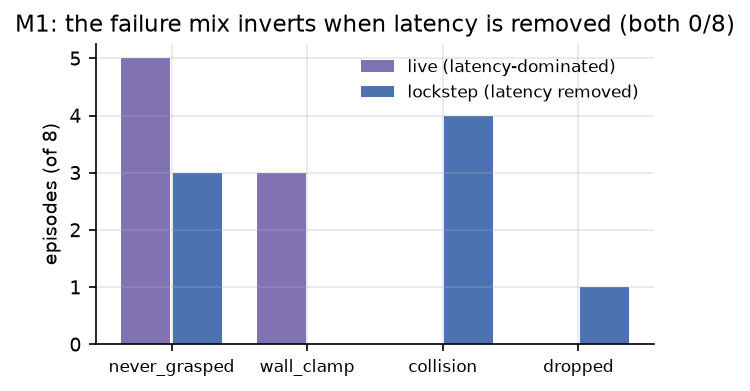

*Figure 7 — the same adapter, same seeds, two conditions, both 0/8:
under live latency the arm barely moves (staleness discards chunks);
under the lockstep condition the policy acts on every tick and acts
wrongly. The inversion is the finding — competence, not compute, is
the current wall. Sources: the M1 findings (live) and the committed
lockstep run.*

**Granular physics (PW-0).** A registered feasibility spike scoped the
powder task family before any campaign: Metal MPM is nondeterministic
(GPU atomics) and ~10% crashy — exploration only; CPU is bit-exact but
~20x slower at 4 mm scoop scale; the scripted scoop's transferred-mass
CV is ~88% (open-loop dosing is a coin flip); granular repose does not
emerge in this regime; and at 2 mm the quantization objection to ±1%
dosing dissolves (12 mg particles) while the Metal/CPU gap narrows to
2.1x. Ratified scope: primitives only (P0/P1), MPM sand, ≤5k particles
CPU-scored, no repose-dependent verifiers, P2+ deferred pending a CUDA
determinism spike. The family's dosing fidelity is honestly labeled a
control-strategy claim, never a milligram claim, per its own spec.

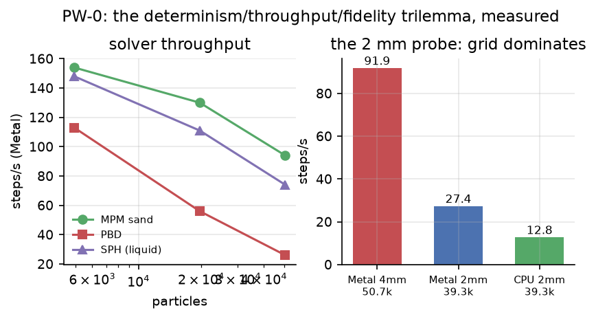

*Figure 8 — the trilemma in two panels: MPM scales best of the
candidates on Metal (left), and the 2 mm probe (right) shows grid
resolution, not particle count, dominating cost — which also narrows
the Metal/CPU gap to 2.1x and weakens the case for tolerating GPU
nondeterminism at fine scale. Values from the ratified ADR tables (the
raw sweep's durable record).*

### 4.10 The environment ladder (M3): the swap works; the ranking question needs variance

The cheapest tier of the three-tier environment ladder (surrogate ->
physics -> hardware) exists to screen candidates. A v0 deterministic
kinematic surrogate behind the bridge's exact topic surface ran all 16
launchable agent-authored H1 graphs UNMODIFIED — full pipeline,
planner to frozen verifier, 128 episodes, zero launch failures, at
~100x Genesis speed. The mechanical claim (environment tiers are a
node swap) holds. The pre-registered ranking measurement, however, is
honestly undecidable: the launchable population carries almost no
Genesis outcome variance (13/16 identical scores), and the cartoon
compresses the contact-graded remainder to a constant — Spearman is
reported as undefined rather than fabricated. The H3 lesson recurs at
the environment tier: a ranking instrument is only measurable on a
population with outcome spread, located before the campaign. What the
learned backbone must add is now precisely sized: contact-outcome
discrimination.

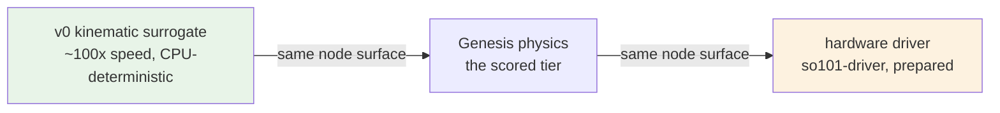

*Diagram 5 — the environment ladder: one topic contract, three
backends. The M3 campaign exercised the left edge (16/16 unmodified
agent graphs); Phase-6 prep landed the right one behind the same
surface.*

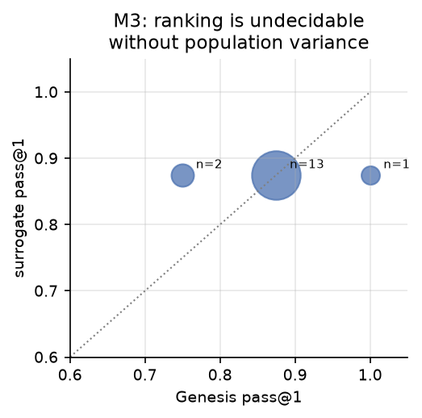

*Figure 9 — Genesis vs surrogate pass@1 per population graph, point
size by multiplicity, from `analysis/m3/records.json`. Thirteen of
sixteen graphs share one Genesis score and the surrogate maps all
sixteen to one value: rank correlation is undefined and is reported
that way. The plot IS the instrument-design finding.*

### 4.11 The reset and the evaluator (A6/A7)

Teleport reset: 1.00 pass@1 in 6.4 min. Behavioral reset: 0.80 in 9.6
min (+19 s/episode, 3 audited fallbacks) — the reset is itself a
manipulation task that sometimes fails, which is the real-world parity
the fast inner loop conceals. The realistic-verifier ablation (A7)
studies research under an imperfect evaluator — the deployment
condition; its protocol and calibration envelope are recorded, with the
identity stage's measured envelope explicitly bounded (three-axis
domain randomization is out of envelope, measured broken, and no
threshold fixes it).

## 5. The meta-result: an instrument that corrects itself

Across the program, the pattern that we believe generalizes:

- **Pre-registration with amendment discipline.** H6 ran under five
  amendments — fault magnitudes the expert absorbed (measured, then
  redesigned under a pre-registered clause), an injection/session race,
  a substrate incompatibility, a credit-window defect — each recorded
  before any scored cell, none after.
- **Plausible mechanisms are the enemy.** The recovery-collision fix
  built on "the delivered box lies off-centre" was falsified by its own
  re-measure (byte-identical outcomes; the box sits at centre; the real
  mechanism — an arm link sweeping the shelf during a tray-zone descent
  — was then traced from oracle state). The defect class "measurement
  needs a traced mechanism, not a plausible explanation" recurred
  enough to become a standing rule.
- **Gates must be adversarially tested.** The judge-bench gate, the
  env-hash gate (which refused an uncommitted frozen-set graph mid-
  session — correctly), and the dist-drift gate (which caught leftover
  fine-tune packages) each demonstrated their value by refusing work
  this project's own authors attempted. The process needs the same
  teeth: one silently failed PR-create produced a phantom "measurement"
  of unchanged code, caught only because deterministic replay made the
  byte-identical result suspicious — merge chains now verify diff and
  mainline content before anything is measured.
- **Fixes are hypotheses.** A collision fix that filtered
  "wrist-flipped" IK branches regressed the pre-registered suite from
  0.5 to 0.375 by starving legitimate solutions; scoping it to the one
  hop where the measured flip class lives restored 0.5. Both steps were
  measured against the same eight seeds, and the regression is in the
  record beside the repair.
- **Negative results are directional.** Every negative above changed
  the next action: the judge results priced the next cheap test
  (label-rendered frames); the M1 pair redirected spend from serving to
  training; PW-0 scoped a family before it burned a campaign.

## 6. Threats to validity

Small n everywhere (n=1 per arm on most ablations; n=1 per H6 fault
class); one scene family per suite; laptop-class compute (fleet lanes
shared a host with their own simulators rather than one batched
bridge — recorded deviation); dev-measurement UNATTESTED labels on
everything not run under the attested pipeline; the H4 monolithic-
script control condition remains unrun; agent CLIs and models are
moving targets (pins recorded per campaign). The safety zero is a
zero on this task's asymmetry and this guard topology — it is not a
general safety claim.

## 7. Related work

ENPIRE (closed harness, real fleet) — we rebuild the loop open and
measured; ASPIRE's accumulation effect — our H3 finds economy, not
ceiling, at these budgets and locates the instrument-design constraint;
robot-learning benchmarks fix environments and compare policies — we
fix environment *and evaluation machinery* and compare engineering
processes; agentic-coding benchmarks measure code passing tests — our
artifacts control a physical process where a failure class
(`wrong_object`) cannot be retried away. (Full citations deferred to
the venue pass.)

## 8. Conclusion

On a laptop, with receipts: coding agents composed, iterated, reused,
and — for the first time in this program — *operated* typed-dataflow
robot systems under frozen evaluation, producing findings on both
sides of the ledger and never once delivering the wrong medicine. The
substrate claim survives contact with its own audit machinery, which
is the only way we would want to make it. The model tier is closed at
its measured end-states with every remainder explicitly gated on
compute or design, and the hardware entry is prepared as the contract
promised: a driver node behind the same typed surface, with the same
fail-closed calibration the simulator answers to.

## Reproducibility

Repo: heyong4725/aisle. Every campaign: protocol ADR + analyzer tool +
committed records; every number in this paper traces to a run id named
in analysis/. Every data figure regenerates from those records with
`uv run python tools/paper_figures.py` (the manifest it prints names
each figure's sources). Single-machine (macOS arm64, uv-locked env,
pinned dora rev, pinned model revisions).
